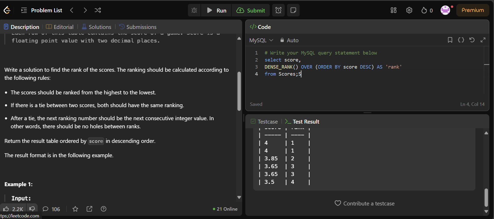
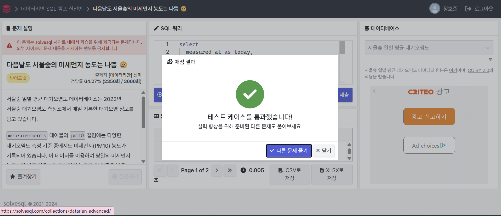

## **📌 Week 1: 윈도우 함수 (Window Functions)**

---

### **1️⃣ 주요 개념**

- **윈도우 함수 (Window Functions)**:
    - `ROW_NUMBER()`, `RANK()`, `DENSE_RANK()`
    - `LAG()`, `LEAD()`
    - `SUM() OVER()`, `AVG() OVER()`
    - `PARTITION BY`, `ORDER BY` 등
- 해당 문법의 개념과 사용 시 주의할 점들을 정리하여 깃허브에 정리해 주세요.

---

### 윈도우 함수 개념과 문법 

* 윈도우 함수 : 각 행에 대해 결과를 생성하면서도 그룹 내 다른 행 정보도 함께 활용 

    * 모든 행에 대해서 연산을 수행 

* 윈도우 함수를 사용할 때는 OVER()절을 포함 
    * SUM(), AVG(), COUNT() -> 집계함수의 경우도 OVER()를 활용하면 윈도우 함수로 활용 가능 

    * RANK(), DENSE_RANK(), ROW_NUMBER() 같은 순위는 OVER()절을 필수적으로 활용 필요!


#### 주요 윈도우 함수 

* ROW_NUMBER() : 각 그룹 내에서 행 번호를 매김(중복 없이 순위)

* RANK(), DENSE_RANK() : 순위를 매기지만, 공동 순위 존재 가능 

    * RANK() : 순서를 건너뜀
    * DENSE_RANK() : 순서를 건너뛰지 않음

* SUM(), AVG(), COUNT() : 누적합 구할 때 자주 활용

* LAG() / LEAD() : 바로 이전 행 / 다음 행 값을 가져옴

* CUME_DIST() : 누적분포 의미!!

    * 반환값 범위 : 0~1
    * 반드시 ORDER BY 절과 같이 활용 -> 의미있는 값 도출 가능 

* LEAD(expr, N, default) : 현재 행보다 N개 뒤에 있는 행의 값 반환 

* NTH_VALUE(expr, N) : 현대 윈도우 프레임에서 N번째 행의 값 반환

* NTILE(N) : 윈도우 내 데이터를 N개의 그룹번호로 나누고 현재 해당 행이 속한 행의 값 반환


### **2️⃣ 과제 안내**

각 개념에 대해 공식 문서를 참고하여 정리하고, 해당 개념을 활용하여 문제를 해결하세요.

### **✅ 윈도우 함수 (Window Functions) 학습 및 문제 풀이**

📖 **공식 문서 정리하기**

- **[공식 문서 정리 범위]: 아래의 순서대로 내용을 확인하시면 정리에 도움이 되실 겁니다.** 반드시 **모든 내용을 정리할 필요는 없으며** 본인에게 도움이 될 만한 새로 배운 내용들을 정리해주시면 충분합니다.
    - 🔗 [MySQL 공식 문서 - 14.20.2. Window Function Concepts and Syntax](https://dev.mysql.com/doc/refman/8.0/en/window-functions-usage.html)
    - 🔗 [MySQL 공식 문서 - 14.20.1. Window Function Descriptions](https://dev.mysql.com/doc/refman/8.0/en/window-function-descriptions.html)
    - (🔗 [MySQL 공식 문서 - 14.20.4. Named Windows](https://dev.mysql.com/doc/refman/8.0/en/window-functions-named-windows.html) ) - OPTIONAL
    - 🔗 [MySQL 공식 문서 - 14.19.1. Aggregate Function Descriptions](https://dev.mysql.com/doc/refman/8.0/en/aggregate-functions.html)
        
        → over_clause를 이용하여 집계함수를 윈도우함수처럼 사용하는 부분만 공부해보세요.
        

📝 **문제 풀이**:

- 🔗 [LeetCode - Rank Scores](https://leetcode.com/problems/rank-scores/description/) `DENSE_RANK()`

```sql

select score, 
DENSE_RANK() OVER (ORDER BY score DESC) AS 'rank'
from Scores;

```



- 🔗 [Solvesql - 다음날도 서울숲의 미세먼지 농도는 나쁨 😢](https://solvesql.com/problems/bad-finedust-measure/) `LEAD()`

```sql

select
  measured_at as today,
  DATE(measured_at, '+1 day') as next_day,
  pm10,
  next_value as next_pm10
FROM
  (
    select
      measured_at,
      pm10,
      LEAD(pm10, 1) OVER (
        ORDER BY
          measured_at
      ) AS next_value
    from
      measurements
  )
where
  pm10 < next_value

```



- 🔗 [programmers - 그룹별 조건에 맞는 식당 목록 출력하기](https://school.programmers.co.kr/learn/courses/30/lessons/131124) (도전!!)
    
    → 문제를 푸는 다양한 방식이 있지만, **윈도우 함수를 사용하여** 해결하는 방식에 대해 고민해 보시길 바랍니다.
    
    *DATE 형식을 문제의 조건에 맞게 작성해주어야 통과되므로, DATE_FORMAT을 사용해주세요~