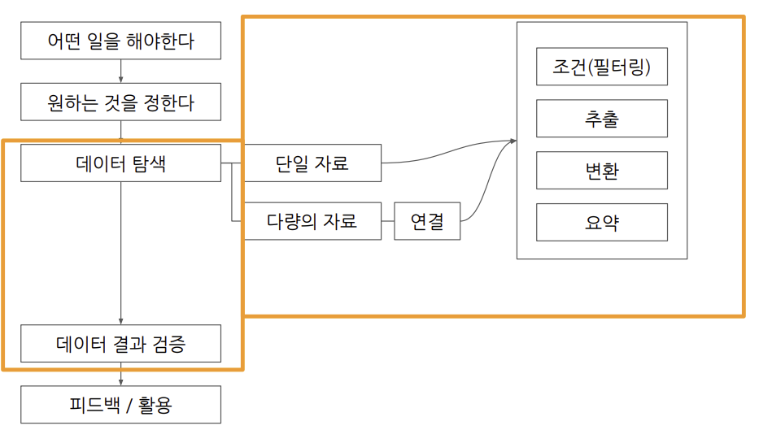
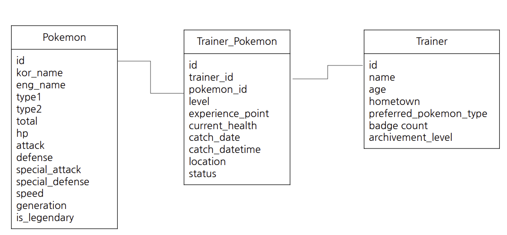

# 1-1. BigQuery 기초 지식 
## 1. 데이터 저장 형태

### Database(DB)
데이터의 저장소

### Table 
데이터가 저장된 공간
* 저장된 데이터를 제품(앱,웹)에서 사용 

## 2. 데이터가 저장되는 장소

MYSQL, ORACLE, PostgreSQL 같은 데이터베이스에 주로 저장 

## 3. MYSQL, ORACLE, PostgreSQL 같은 데이터베이스들의 특징 -> OLTP

OLTP(Online Transaction Processing)

-> 거래를 하기 위해 사용되는 데이터 베이스

-> 보류, 중간 상태 X / 데이터가 무결함

-> 데이터의 추가(INSERT), 데이터의 변경(UPDATE)이 많이 발생 

-> SQL을 사용해 데이터를 추출할 수 있으나 분석을 위해 만든 데이터베이스가 아니라 쿼리 속도가 느릴 수 있음

## 4. SQL 

데이터베이스에서 데이터를 가지고 올 떄 사용하는 언어

데이터베이스의 데이터를 관리하기 위해 설계된 특수 목적의 프로그래밍 언어 

쿼리를 짠다 등 쿼리 포함 용어로 표현 

## 5. 테이블에 저장된 데이터의 형태

- 테이블 구조 

행(Row) : 새로운 행은 가로로 한줄을 의미 
* 하나의 행이 하나의 고유한 데이터

열(Column) : 세로 
* 각 데이터의 특정 속성 값

## 6. 테이블에 저장된 데이터의 형태 

엑셀, 스프레드시트에 저장된 형태와 유사 

## 7. OLAP와 데이터 웨어하우스(DW)의 등장

등장 배경 : OLTP의 속도, 기능 부족 이슈 

OLAP : Online Analytical Processing 
* 분석을 위한 기능 제공 

데이터 웨어하우스 
* 데이터를 한 곳에 모아서 저장 
* 여러 곳에 저장된 데이터 예시 (Database, 웹, 파일, API의 결과 등)

## 8. BigQuery 

### 소개 

Google Cloud의 OLAP + Data Warehouse 

-> Google Cloud의 데이터 웨어하우스

### 장점 

1. 난이도 : SQL을 활용 -> 쉽게 데이터 추출 가능 

2. 속도 : OLAP 도구이므로 속도가 빠름(그 대가는 유료)

3. Firebase, GoogleAnalytics4의데이터를 쉽게 추출할 수 있음
* 사용기기,위치(시단위까지표현),OS버전,이벤트행동획득가능(별도의로깅필요)

4. 데이터웨어하우스를 사용하기 위해 서버(컴퓨터)를 띄울 필요없음
* 구글에서 인프라를 관리함

### 사용하는 이유 

* 회사에서 앱이나 웹에서 Firebase, GoogleAnalytics4를 활용할 경우
* 운영을 적은 비용(인력등)으로 진행하기 위해

## 9. BigQuery의 환경 구성 요소

1. 프로젝트(Project)
* 하나의 프로젝트에 여러 데이터셋이 존재할 수 있음

2. 데이터셋(Dataset)
* 판매데이터,고객데이터등 별도의 데이터를 저장할 수 있음 
* 하나의 데이터셋에 다양한 테이블이 존재할 수 있음

3. 테이블(Table)
* 테이블안엔 상품의 세부정보가 저장
* 테이블안엔 행과열로 이루어진 데이터들이 저장

## 10. 데이터를 활용하는 과정

* 색깔 친 부분 SQL로 처리 가능(강의 내용)

# 1-2 저장된 데이터 활용하기 

## 1. sql 커리 작성하기 전 생각해볼것

* 데이터가 어떻게 저장되어있나?
* 어떤 데이터 저장되어있나?
* 컬럼의 의미는? 

## 2. 데이터가 저장되는 형태를 알기 위해서는??

ERD(Entity Relationship Diagram) : 데이터베이스 구조를 한눈에 알아보기 위해 사용

### 1) 포켓몬 세상을 데이터로 생각해보기 

* 포켓몬 세상에 존재하는 데이터 
1) 포켓몬
2) 트레이너
3) 트레이너가 잡은 포켓몬
4) 트레이너가 도전한 유저배틀
5) 트레이너가 도전한 체육관배틀
6) NPC
7) 상점
8) 상점별로판매하는제품

### 2) 이커머스 산업의 데이터 생각하기

* 이커머스 산업에 존재하는 데이터
1) 포켓몬 : 상품
2) 트레이너 : 유저
3) 트레이너가 잡은 포켓몬 : 주문
4) 장바구니에 담은 물건
5) 웹페이지 접근 수
6) 웹페이지의 버튼 클릭수 

### 3) ERD 예시(강의 - pokemon)

