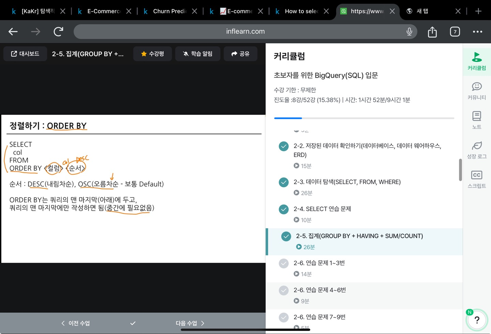

# 2-1. 데이터 탐색 : 요약(집계, 그룹화) - COUNT, DISTINCT, GROUP BY 

```sql

# 집계와 그룹화

* GROUP BY

* 같은 값끼리 모아서 그룹화한다. 

* 특정 칼럼을 기준으로 모으면서 다른 컬럼에서는 집계 가능(합, 평균, MIN, MAX 등)

## SQL로 표현해보기 
SELECT 
    집계할_컬럼1 
    집계 함수(COUNT, MAX, MIN 등)
FROM Table 
GROUP BY 
    집계할_컬럼1 


* 집계할 컬럼을 SELECT에 명시하고 그 컬럼을 꼭 GROUP BY에 작성 

## 집계함수 종류 

* DISTINCT : 중복 제거  
     * 고유값을 알고 싶은 경우, 별개의 여러 값 중에 Unique한 것만 보고 싶은 경우 사용 

## 예시코드 

SELECT
집계할컬럼,
COUNT(DISTINCTcount할-컬럼)
FROM table
GROUPBY
집계할컬럼

## 조건을 설정하고 싶은 경우 : WHERE
 
SELECT 
    컬럼1, 컬럼2,
    COUNT(컬럼1) AS col1_count
FROM <table>
WHERE 컬럼1 >=3 


## 조건을 설정하고 싶은 경우 : HAVING 

* HAVING : GROUP BY한 후 조건을 설정하고 싶은 경우 사용

SELECT
    컬럼1, 컬럼2 
    COUNT(컬럼1) AS col1_count
FROM <table>
GROUP BY 컬럼1, 컬럼2 
HAVING 
    col_count > 3 


## WHERE와 HAVING의 차이 

* WHERE : Table에 바로 조건을 설정하고 싶은 경우 사용

* HAVING : GROUP BY 한 후 조건을 설정하고 싶은 경우 사용 

SELECT
    컬럼1, 컬럼2 
    COUNT(컬럼1) AS col1_count
FROM <table>
WHERE 
    컬럼1 >= 3 
GROUP BY 컬럼1, 컬럼2 
HAVING 
    col_count > 3 


## 서브쿼리 

* SELECT 문 안에 존재하는 SELECT 쿼리 
* FROM 절에 또 다른 SELECT 문을 넣을 수 있음 
* 괄호로 묶어서 사용

* 서브 쿼리를 작성하고, 서브 쿼리 바깥에서 WHERE 조건 설정하는 것 
=> 서브 쿼리에서 HAVING으로 하는 것 

## 정렬하기 : ORDER BY 

SELECT 
    col
FROM 
ORDER BY <컬럼> <순서>

<순서> : DESC(내림차순), OSC(오름차순, default)

* 쿼리의 맨 마지막에만 작성하면 됨!


## 출력 개수 제한하기 : LIMIT 

* 쿼리문의 결과 ROW 수를 제한하고 싶은 경우 사용

* 쿼리문의 제일 마지막에 작성

SELECT 
    col
FROM Table 
LIMIT 10 

## 요약, 집계, 그룹화 정리 

1. 집계하고 싶은 경우 : GROUP BY + 집계함수(AVG, MAX 등)

2. 고유값을 알고 싶은 경우 : DISTINCT 

3. 조건을 설정하고 싶은 경우 : WHERE / HAVING 

4. 정렬하고 싶은 경우 : ORDER BY 

5. 출력 개수를 제한하고 싶은 경우 : LIMIT 
```

### 활동 인증 

