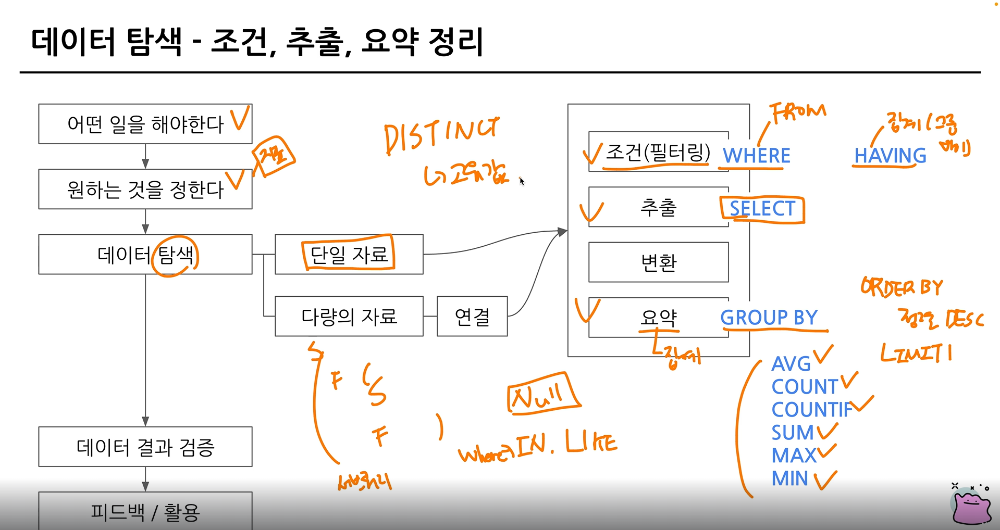
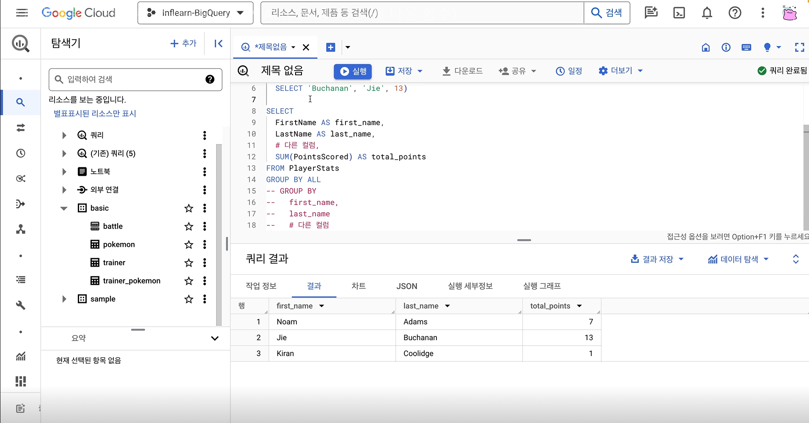
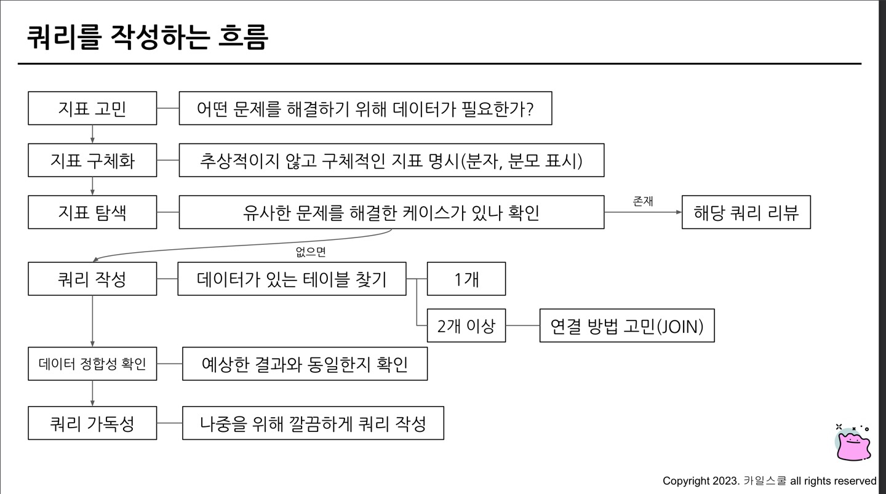
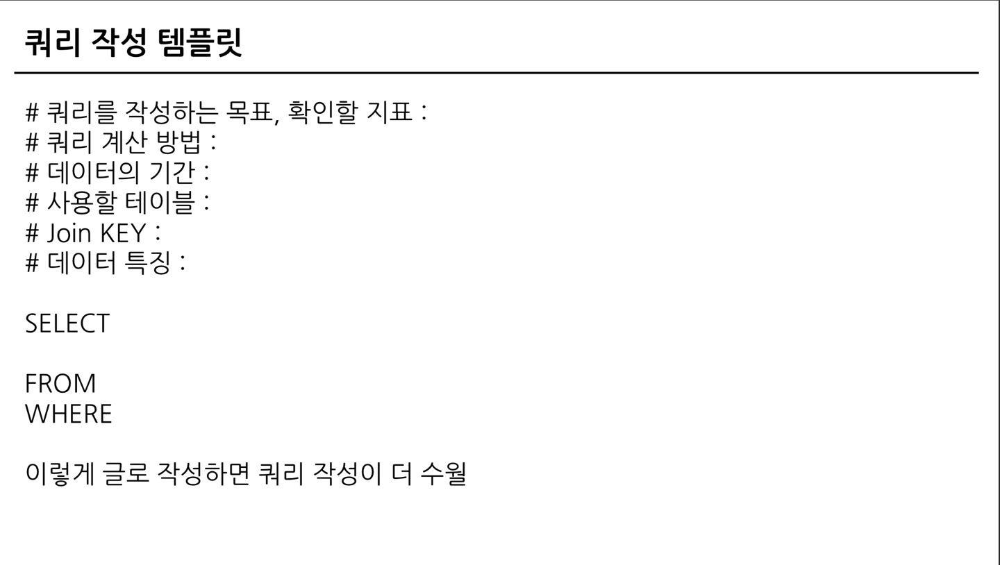
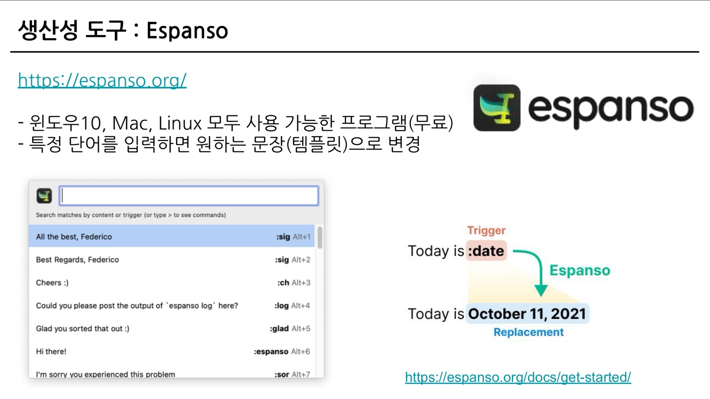
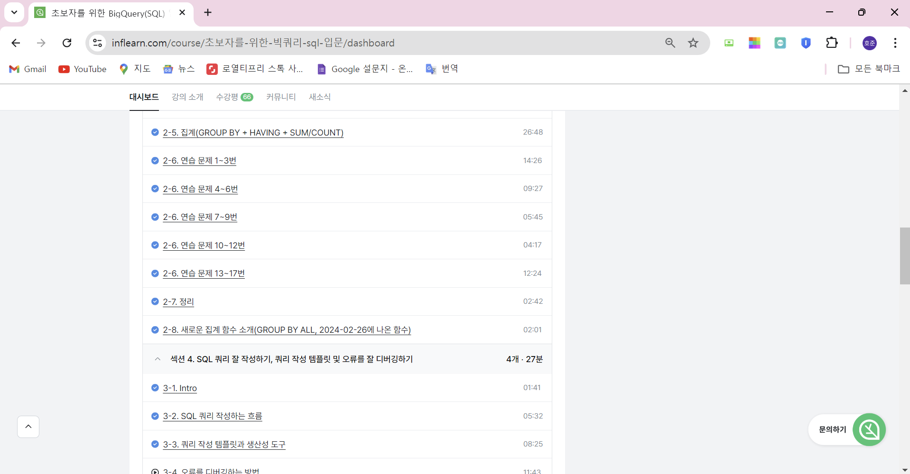

# 3주차 과제 

## 연습문제 1번  

* 조건 : type2 x 
* 테이블 : pokemon
* 컬럼 : 따로 없음, 포켓몬의 수만 남기면 됨 
* 집계 방법 : 포켓몬의 수 -> COUNT 

<정답 코드>
```sql

SELECT 
    COUNT (id) AS cnt 
FROM basic.pokemon 
WHERE
    type2 is NULL 
```
## 연습문제 2번 

* 테이블 : pokemon 
* 조건 : type2가 없는 포켓몬 
* 컬럼 : type1 
* 집계 COUNT(포켓몬 수)
* 정렬 
    * ORDER BY 큰 순으로 : type 1의 포켓몬 수가 큰 순으로 정렬
    * 내림차순(DESC)
    * ORDER BY 포켓몬 수 DESC 

<정답 코드>
```sql

SELECT 
    type1, 
    COUNT(id) AS pokemon_cnt
FROM basic.pokemon 
WHERE
    type2 is NULL 
GROUP BY 
    type1 
ORDER BY 
    pokemon_cnt DESC 
```

## 연습문제 3번 

* 테이블 : pokemon 
* 조건 : type2 상관x, 조건x 
* 컬럼 : type1 
* 집계 COUNT(포켓몬 수)

<정답 코드>
```sql

SELECT 
    type1, 
    COUNT(id) AS pokemon_cnt
FROM basic.pokemon 
GROUP BY 
    type1 

```

## 연습문제 4번 

* 테이블 : pokemon 
* 조건 : x 
* 컬럼 : 전설(is_legendary)
* 집계 : 포켓몬 수 

<정답 코드>
```sql

SELECT 
    is_legendary,
    COUNT(id) AS pokemon_cnt
FROM basic.pokemon 
GROUP BY 
    is_legendary

```

## 연습문제 5번 

* 테이블 : trainer
* 조건 
    * 같은 이름이 2개 이상(동명이인)
    * COUNT(name) -> 2개 이상 
* 컬럼 : 이름
* 집계 : COUNT 

<정답 코드>
```sql

SELECT 
    name,
    COUNT(name) AS trainer_cnt
FROM basic.trainer
GROUP BY 
    name
HAVING
    trainer_cnt >= 2 

```

* WHERE : 원본 데이터 FROM 절에 있는 데이터에 조건을 설정하고 싶은 경우 사용

* HAVING : GROUP BY와 함계 집계 결과에 조건을 설정하고 싶은 경우 


### 서브 쿼리 활용(연습문제 5번)

* 서브 쿼리 : 쿼리문을 한번 감싸서 다른 쿼리문에 사용하는것 

```sql

SELECT
   * 
FROM(
  SELECT 
    name,
    COUNT(name) AS trainer_cnt
  FROM basic.trainer
  GROUP BY 
    name
)
HAVING
  trainer_cnt >= 2 

```
* HAVING을 사용하면 쿼리줄이 줄어든다

## 연습문제 6번 
* 테이블: trainer
* 조건: 트레이너의 이름 => "Iris"
* 컬럼: 모든 컬의 정보 
* 집계: X

<정답 코드>
```sql

SELECT 
  *
FROM basic.trainer
WHERE 
  name = "Iris"
    
```

## 연습문제 7번 
* 테이블: trainer
* 조건: 이름에 "Iris", "Whitney", "Cynthia" 중에 있으면 추출
* 컬럼: 정보 -> * 
* 집계: X

<정답 코드>
```sql

SELECT 
  *
FROM basic.trainer
WHERE 
    name IN ("Iris", "Cynthia", "Whitney") 
    
```


## 연습문제 8번 
* 테이블: pokemon
* 조건: x
* 컬럼: 정보 -> * 
* 집계: X

<정답 코드>
```sql

SELECT 
  COUNT(id) AS pokemon_cnt
FROM basic.pokemon
    
```

## 연습문제 9번 
* 테이블: pokemon
* 조건: x
* 컬럼: generation(세대) 
* 집계: COUNT -> 포켓몬 수 

<정답 코드>
```sql

SELECT
  generation,  
  COUNT(id) AS pokemon_cnt
FROM basic.pokemon
GROUP BY 
  generation    
```


## 연습문제 10번 
* 테이블: pokemon
* 조건: type2 IS NOT NULL => type2가 존재!
* 컬럼: x
* 집계: COUNT -> 포켓몬 수 

<정답 코드>
```sql

SELECT 
  COUNT(id) AS pokemon_cnt
FROM basic.pokemon
WHERE 
  type2 IS NOT NULL

```

## 연습문제 11번 
* 테이블: pokemon
* 조건: type2가 있는
* 컬럼: type1
* 집계: COUNT -> 제일 많은 

<정답 코드>
```sql

SELECT 
  type1,
  COUNT(id) AS pokemon_cnt
FROM basic.pokemon
WHERE 
  type2 IS NOT NULL
GROUP BY 
  type1
ORDER BY 
  pokemon_cnt DESC 
LIMIT 1 # 행 수를 제한하는 것(1행)

```


# 연습문제 12번 
* 테이블: pokemon
* 조건: 단일 타입 
    * type2 : NULL
* 컬럼: type1
* 집계: COUNT

<정답 코드>
```sql

SELECT 
  type1,
  COUNT(id) AS pokemon_cnt
FROM basic.pokemon
WHERE 
  type2 IS NULL
GROUP BY 
  type1
ORDER BY 
  pokemon_cnt DESC 
LIMIT 1 
  
```

# 연습문제 13번 
* 테이블: pokemon
* 조건: name에 '파' 포함 
* 컬럼: name(어떤 포켓몬?)
* 집계: x

<정답 코드>
```sql

SELECT
  kor_name
FROM basic.pokemon
WHERE
  kor_name LIKE "%파%"
  
```
* 컬럼 LIKE : "특정단어%", %는 단어 앞에도 붙을 수 있고, 뒤에도 붙을 수 있음

* "%파" : 파로 시작하는 말 

* "파%" : 파로 끝나는 말 

* "%파%" : 파가 들어가는 말 

* 문자열 컬럼에서 특정 단어가 포함되어있는지 알고 싶은 경우엔 LIKE를 사용하면 편함 

# 연습문제 14번 
* 테이블: trainer
* 조건: badge_count >= 6
* 컬럼: x
* 집계: COUNT(트레이너의 수)

<정답 코드>
```sql

SELECT
  COUNT(id) AS trainer_cnt
FROM basic.trainer
WHERE
  badge_count >= 6
  
```

# 연습문제 15번 
* 테이블: trainer_pokemon
* 조건: x
* 컬럼: trainer_id
* 집계: COUNT(포켓몬의 수)

<정답 코드>
```sql

SELECT
  trainer_id
  COUNT(pokemon_id) AS pokemon_cnt
FROM basic.trainer_pokemon
GROUP BY 
  trainer_id
ORDER BY 
  pokemon_cnt DESC 
LIMIT1 
```

# 연습문제 16번 
* 테이블: trainer_pokemon
* 조건: status = 'Released'
* 컬럼: trainer_id
* 집계: COUNT(많이 풀어준)

<정답 코드>
```sql

SELECT
  trainer_id,
  COUNT(pokemon_id) AS pokemon_cnt
FROM basic.trainer_pokemon
WHERE
  status = "Released"
GROUP BY
  trainer_id
ORDER BY
  pokemon_cnt DESC
```

# 연습문제 17번 
* 테이블: trainer_pokemon
* 조건: 풀어준 포켓몬의 비율 = (풀어준 포켓몬 수/전체 포켓몬 수) 20%보다 크다
* 컬럼: trainer_id
* 집계:  COUNTIF(조건): COUNTIF(컬럼 = "3") 
* released_ratio >= 0.2 

<정답 코드>
```sql

SELECT
  trainer_id,
  COUNTIF(status = "Released") AS released_cnt, # 풀어준 포켓몬 수
  COUNT(pokemon_id) AS pokemon_cnt,
  COUNTIF(status = "Released") / COUNT(pokemon_id) AS released_ratio
FROM basic.trainer_pokemon
GROUP BY
  trainer_id
HAVING
  released_ratio >= 0.2
```

## 정리




## 새로운 집계함수 소개 

GROUP BY ALL : 모든 그룹화 가능한 컬럼을 자동으로 추론하여 그룹화함 



## SQL 커리 작성하는 흐름 

* 지표 고민 -> 지표 구체화 -> 지표 탐색 -> 쿼리 작성 -> 데이터 정합성 확인 -> 쿼리 가독성 -> 쿼리 저장 




## 쿼리 작성 템플릿과 생산성 도구 

1. 쿼리 작성 탬플릿 

* 쿼리를 작성하는 목표, 확인할 지표 
* 쿼리 계산 방법 
* 데이터의 기간 
* 사용할 테이블
* Join KEY : 
* 데이터 특징 : 



2. 생산성 도구

* 템플릿 쉽게 사용하기 

* 생산성 도구 : Espanso 
    * 원도우 10, MAC, Linux 모두 사용 가능한 프로그램(무료)
    * 특정 단어를 입력하면 원하는 문장(템플릿)으로 변경 가능 

* 생산성 도구 : Espanso 핵심 로직 
-> 특정 단어가 감지 : 정의된 것으로 간주 

* 생산성 도구 : Espanso 수정하기(base.yml)

* 생산성 도구 : BigQuery Console에서 확인




## 강의수강인증
