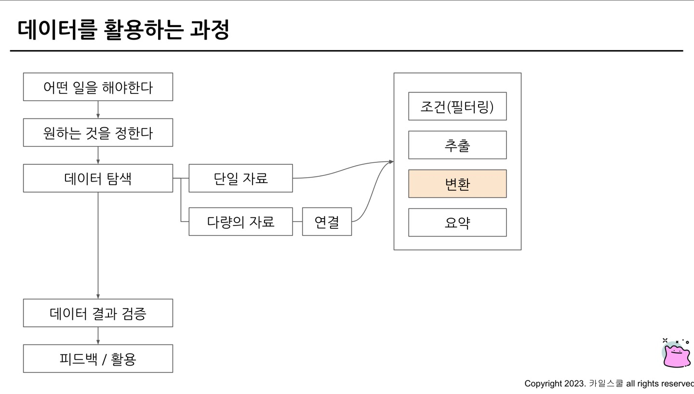

# 4주차 과제 

## 오류를 디버깅하는 방법 

### 오류란? 


### 오류의 종류

```sql
1. SELECT list must not be empty at [10:1]

* 의미 : SELECT 목록은[10:1]에서 비어있으면 안됩니다 

SELECT 
 col # 이 부분이 비어있기 때문에 생기는 오류 
FROM 


2. Number of arguments does not match for aggregate function COUNT 

* 의미 : 집계함수 COUNT의 인자 수가 일치하지 않습니다. 

SELECT 
 COUNT(id, kor_name) -> COUNT(kor_name, eng_name)로 수정
FROM basic.pokemon 

3. SELECT list expression references column type1 a which is neither grouped nor aggregated

* 의미 : SELECT 목록 식은 다음에서 그룹화되거나 집계되지 않은 열을 참조, GROUP BY에 적절한 컬럼을 명시하지 않았을 경우 발생하는 오류

4. Syntax error : Expected end of input but got keyword SELECT 

* 의미 : 입력이 끝날 것이라고 예상되었지만 SELECT 키워드가 입력됨 

* 해결방안 
1. SELECT 근처 확인하기 
2. 하나의 쿼리엔 SELECT가 1개만 있어야함 
3. 혹은 쿼리가 끝나는 부분에 ; 붙이고 실행할 부분만 드래그 앤 드랍해서 실행 

5. Syntax error : Expected end of input but got keyword WHERE at [5:1]

* 의미 : 입력이 끝날 것으로 예상되었지만 [5:1] 키워드에서 WHERE을 얻었습니다. 

6. Syntax error : Expected ")" but got end of script at [8:11]

* 의미 : ")" 가 예상되지만 [8:11]에 스크립트가 끝났습니다. 즉 괄호를 작성 x 

```
 
### 오류 메시지 해결의 핵심  


## 데이터를 활용하는 과정 



## 데이터 변환 

* 데이터 타입 : 숫자, 문자, 시간&날짜, 부울(Bool)

### 자료 타입 변경 

```sql

1. 자료 타입을 변경하는 함수 : CAST 

SELECT 
 CAST (1 AS STRING) # 숫자 1을 문자1로 변경 


* 안전하게 데이터 타입 변경 : SAFE_CAST 
-> SAFE_가 붙은 함수는 변환이 실패한 경우 NULL 반환 

2. 수학함수 

* 다양한 계산 존재, 암기 x, 이용할 떄 찾기

```

## 문자열(STRING) 함수 


```sql

1. CONCAT 

* 문자열을 붙이는 함수 

Ex)
SELECT 
 CONCAT("안녕", "하세요") AS concat_example

* 결과 : "안녕하세요" 

2. SPLIT

* 문자열 분리하는 함수 

Ex) 
SELECT 
 SPLIT("가,나,다,라", ",") AS split_example

 * 결과 : "가", "나", "다", "라" (배열)

 3. REPLACE 

 * 특정 단어를 수정하는 함수

 Ex) 
 SELECT 
  REPLACE("안녕하세요", "안녕", "실천") AS replace_example 

  * 결과 : "실천하세요"

4. TRIM 

* 문자열을 자르는 함수 

 Ex) 
 SELECT 
  TRIM("안녕하세요", "하세요") AS trim_example 

* 결과 : "안녕" 

5. UPPER

* 영어 대문자로 변환하는 함수

 Ex) 
 SELECT 
  UPPER("ab") AS upper_example 

* 결과 : "AB"

```

## 날짜 및 시간 데이터 이해하기 

```sql
* 핵심 

1) 날짜 및 시간 데이터 타입 파악 : DATE, DATETIME, TIMESTAMP 

2) 날짜 및 시간 데이터 관련 알면 좋은 내용 : UTC, Millisecond

3) 날짜 및 시간 데이터 타입 변환하기 

4) 시간 함수 (두 시간의 차이, 특정부분 추출)

```

```sql
* 핵심 

1. UTC
* 한국시간 : UTC+9 
* 국제적인 표준시간

2. TIMESTAMP 
* 시간도장
* UTC로부터 경과한 시간을 나타낸 값 
* TIME Zone 정보 O
* ex) 2023-12-31 14:00:00 UTC

3. milesecond(ms)
* 시간 단위 : 천분의 1초 
* 빠른 반응이 필요한 분야에서 사용(초보다 더 정확)
* Millisecond -> TIMESTAMP -> DATETIME으로 변경 

4. microsecond(us)
- 1/1000ms, 1/1000000초 
```

## 강의수강인증

