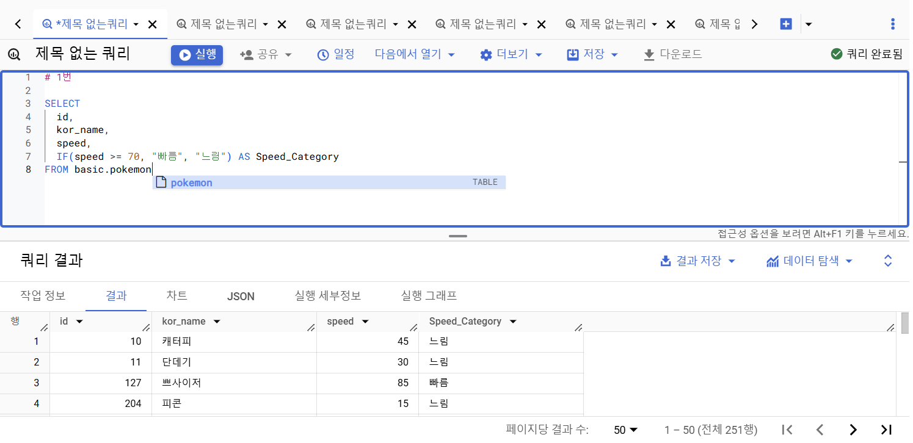

# 5주차 과제 


## 4-4(2) 날짜 및 시간 데이터 이해하기


* 정리 
```sql
1. 데이터 타입 : 날짜 및 시간 데이터 

- DATE 
- DATETIME : DATE + TIME (타임존 정보x)
- TIMESTAMP : 특정 시점에 도장 찍은 값 (타임존 정보0)
- UTC : 국제적인 표준 시간. 한국은 UTC+9 
- Millisecond : 1/1000초
- Microsecond : 1/1000ms

2. 시간 데이터 타입 변환하기
TIMESTAMP_MILLIS 
TIMESTAMP_MICROS
DATETIME
- 문자열 -> DATETIME : PARSE_DATETIME
- DATETIME -> 문자열 : FORMAT_DATETIME

3. 현재 DATETIME : CURRENT_DATETIME
DATETIME 의 특정 부분 추출 : EXTRACT 
DATETIME 특정 부분 자르기 : DATETIME_TRUNC
DATETIME 차이 구하기 : DATETIME_DIFF

4. 정리 
* DATETIME 함수 위주로 다루었으나, 대부분 TIMESTAMP, DATE에도 사용할 수 있는 함수

* 대표적인 함수만 기억하고 필요할 떄 찾아서 사용할것 

* 자주 사용하는 함수는 따로 저장해두기 
- Millisecond to Datetime
- Parse Datetime 

```


## 연습문제

### 1번 


### 2번 

.png)

### 3번


### 4번


### 5번 


## 4-6 조건문 함수

### 조건문 

* 특정 조건이 충족되면, 어떤 행동을 하자
* 특정 조건이 참일 때, A 아니면 B
* 조건에 따라 다른 값을 표시하고 싶을 때 사용 

#### 조건문 사용 방법 

1) CASE WHEN 
2) IF 

#### 조건문 함수가 사용되는 이유

* 데이터 분석시, 특정 카테고리를 하나로 합치는 전처리가 필요한 경우가 있음

### 1) CASE WHEN 

* 여러 조건이 있을 경우 유용
```sql
<문법>

SELECT
  CASE 
    WHEN 조건1 THEN 조건1이 참일 경우 결과
    WHEN 조건2 THEN 조건2가 참일 경우 결과 
    ELSE 그 외 조건일 경우 결과 
END AS 새로운_컬럼_이름  

* 조건 1, 조건2에 둘 다 해당하면 앞선 순서를 따름
* 문자열 함수(특정 단어 추출)에서 이슈가 자주 발생

```

### 2) IF

* 단일 조건일 경우 유용

```sql
<문법>
- IF(조건문, True일 때의 값, False일 떄의 값) AS 새로운_컬럼_이름

SELECT
 IF(1=1, '동일한 결과', '동일하지 않은 결과') AS result1,
 IF(1=2, '동일한 결과', '동일하지 않은 결과') AS result2

```


## 조건문 연습문제 

### 1번 

### 2번 

### 3번 

### 4번

### 5번 

### 6번 


## 정리 

* 칼럼 변환하기 정리 
- 데이터 타입 : 숫자, 문자, 시간/날짜, Bool

<기억해야하는 함수(나머지는 찾으면서)>
* CONCAT, SPLIT, REPLACE, TRIM, UPPER
* EXTRACT(HOUR FROM datetime),DATETIME_TRUNC, PARSE_DATETIME
* 데이터 타입 변경하기, 조건문, CASE WHEN, IF 

## BigQuery 공식문서 확인하기 

* 개발 공식 문서 활용할것!! 
    * 최신 함수 제공
    * BigQuery를 비롯한 대부분 프로그래밍 관련 내용 적용 가능
    * 챗gpt와 구글링과 함께 활용하면 좋음 

* 찾는 방법
    * "기술명+documentation"으로 검색
    ex) BigQuery Documentation