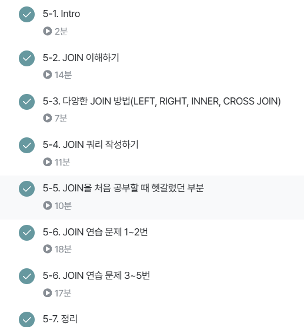

# 6주차 과제 

## 5-1. Intro. JOIN 다량의 데이터 연결

* 다량의 자료 연결 : JOIN

## 5-2. JOIN 이해하기

* JOIN : 서로 다른 테이블을 연결하는 것 

* 테이블들을 연결할 수 있는 공통 컬럼(key)를 찾아야 함

* id 값을 key로 많이 사용함

* JOIN을 통해 데이터가 저장되는 형태에 대한 이해 가능 

## 5-3. 다양한 JOIN 방법 


* INNER JOIN : 두 테이블의 공통 요소만 연결 

* LEFT/RIGHT(OUTER) JOIN : 왼쪽/오른쪽 테이블 기준으로 연결, 없는 요소는 NULL값 

* CROSS JOIN : 두 테이블의 각각의 요소를 곱함. 데이터가 매우 커질 수 있다는 주의점이 있음 

## 5-4. JOIN 쿼리 작성하기 

* 진행과정 
    * 테이블 확인 : 테이블에 저장된 데이터 컬럼 확인
    * 기준 테이블 정의 : 가장 많이 참고한 기준 테이블 정의
    * JOIN KEY 찾기 : 여러 테이블과 연결할 key 정리 
    * 결과 예상하기 : 결과 테이블을 예상해서 비교 등을 위해 엑셀로 작성
    * 쿼리 작성 / 검증 : 예상한 결과와 같은지?? 

* JOIN 문법 
```sql
SELECT 
    A.col1,
    A.col2,
    B.col1,
    B.co12
FROM table1 AS A 
LEFT JOIN table2 AS B 
ON A.key = B.key 

*** JOIN은 항상 FROM 아래!!!

```

## 5-5. JOIN을 처음 공부할 때 헷갈렸던 부분

1) 여러 JOIN 중 어떤 것을 사용해야 할까? 

* 하려고 하는 작업의 목적에 따라 JOIN을 선택해보기 

    * 교집합 : INNER
    * 모두 다 조합 : CROSS 
    * LEFT or RIGHT : LEFT 추천 

* 쿼리 작성 템플릿에 예상하는 쿼리를 작성하고, 중간 결과도 생각하면서 찾아보기

2) 어떤 Table을 왼쪽에 두고, 어떤 Table이 오른쪽에 가야할까? 

* LEFT JOIN : 기준이 되는 Table 왼쪽에 두기 

* 기준에는 기준값이 존재, 우측에는 계속 데이터 추가 

3) 여러 Table을 연결할 수 있는걸까? 

* JOIN의 개수에 한계는 없음 

* 너무 많이 JOIN하고 있는지 확인

4) 컬럼은 모두 다 선택해야 할까? 

* 컬럼 선택은 데이터를 추출해서 무엇을 하고자?가 굉장히 중요 

* JOIN이 잘 되었나 확인하기 위해 처음엔 많은 컬럼을 선택해도 괜찮으나, 사용하지 않을 컬럼은 선택하지 않는 것이 BigQuery에서 비용을 줄일 수 있음 

* id 같은 값은 Unique한지 확인하기 위해 자주 사용되므로 id는 자주 사용하는 편 

5) NULL이 대체 뭐죠??

* NULL : 값이 없음, 알 수 없음 

* 0이나 공백과 다르게 값이 아예 없는 것 

* JOIN에선 연결할 값이 없는 경우 나타남

## 5-6 JOIN 연습문제 

1. 트레이너가 보유한 보유한 포켓몬들은 얼마나 있는지 쿼리 작성하기 

* 정리 
```sql

SELECT
  kor_name,
  COUNT(tp.id) AS pokemon_cnt
FROM(
SELECT
  id,
  trainer_id,
  pokemon_id,
  status
FROM basic.trainer_pokemon
WHERE status IN ('Active', 'Training')
) AS tp
LEFT JOIN basic.pokemon AS p
ON tp.trainer_id = p.id
GROUP BY
  kor_name
ORDER BY
  pokemon_cnt DESC

```


2. 각 트레이너가 가진 포켓몬 중에서 'Grass' 타입의 포켓몬 수를 계산(편의상 type1 기준으로 계산)

* 정리 
```sql

# Grass 타입만 WHERE 조건으로
SELECT
  p.type1,
  COUNT(tp.id) AS pokemon_cnt
FROM(
SELECT
  id,
  trainer_id,
  pokemon_id,
  status
FROM basic.trainer_pokemon
WHERE status IN ('Active', 'Training')
) AS tp
LEFT JOIN basic.pokemon AS p
ON tp.trainer_id = p.id
WHERE
  type1 = 'Grass'
GROUP BY
  type1
ORDER BY
  2 DESC # 두 번째 열 기준 내림차순

```


3. 트레이너의 고향(hometown)과 포켓몬을 구획한 위치(location)을 비교하여, 자신의 고향에서 포켓몬을 포획한 트레이너의 수 계산(status 상관없이 구하기)

* 정리 
```sql


SELECT
  COUNT(DISTINCT tp.trainer_id) AS trainer_uniq # DISTINCT를 사용해야 '트레이너 수'를 구할 수 있음
FROM basic.trainer AS t
LEFT JOIN basic.trainer_pokemon AS tp
ON t.id = tp.trainer_id
WHERE
  location IS NOT NULL
  AND t.hometown = tp.location 

```

4. Master 등급인 트레이너들은 어떤 타입의 포켓몬을 제일 많이 보유? 

* 정리 
```sql

SELECT
  type1,
  COUNT(tp.id) AS pokemon_cnt
FROM(
SELECT
  id,
  trainer_id,
  pokemon_id,
  status
FROM basic.trainer_pokemon
WHERE status IN ('Active', 'Training')
) AS tp
LEFT JOIN basic.trainer AS t
ON tp.trainer_id = t.id
LEFT JOIN basic.pokemon AS p
ON tp.pokemon_id = p.id
WHERE
  t.achievement_level = "Master" # 마스터 등급 트레이너만
GROUP BY
  type1
ORDER BY # 포켓몬 수 기준 내림차순
  2 DESC
LIMIT 1 # 가장 많이 보유한 타입 하나만 출력
```

5. Incheon 출신 트레이너들은 1세대, 2세대 포켓몬을 얼마나 보유하고 있나? 


* 정리 
```sql
SELECT
  generation,
  COUNT(tp.id) AS pokemon_cnt
FROM(
SELECT
  *
FROM basic.trainer_pokemon
WHERE status IN ('Active', 'Training')
) AS tp
LEFT JOIN basic.trainer AS t
ON tp.trainer_id = t.id
LEFT JOIN basic.pokemon AS p
ON tp.pokemon_id = p.id
WHERE
  t.hometown = "Incheon"
GROUP BY
  generation
```

## 5-7 정리 

* JOIN : 여러 테이블 연결 시 사용 

* Key : 공통 컬럼 

* JOIN 종류 
    * (INNER) JOIN 
    * LEFT/RIGHT(OUTER) JOIN 
    * FULL(OUTER)JOIN 
    * CROSS JOIN


## 강의 수강 인증 

