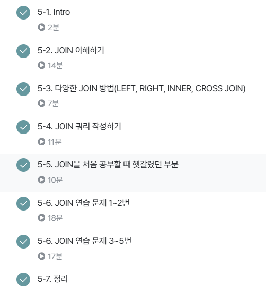

# 7주차 과제 

## 6-1. Intro. 

* 데이터 결과 검증 

* SQL 스타일 가이드 

* 데이터 검증 

* 데이터 결과 검증 

## 6-2. 가독성을 챙기기 위한 SQL 스타일 가이드

### 데이터 결과 검증 하기 전 

#### <실수는 언제 발생하는가?> 

* 문법을 잘못 알고 있는 경우 
* 데이터를 파악하지 않고 쿼리를 작성하는 경우 
* 쿼리가 복잡한 경우 

#### <다른 사람의 쿼리를 봐야하는 경우 또는 내 쿼리를 다른 사람이 보는 경우>

* 쿼리를 가독성 있게 잘 작성했으면 별도의 설명이 없어도 이해할 가능성이 존재 
* 매번 설명을 해야하면, 이 쿼리를 보는 사람들이 많아질수록 내 시간을 쓰게 됨 
* 쿼리를 변경해야 할 경우에 특정 부분만 바꿨는지, 전체를 바꿨는지도 파악하는 것이 쉬우면 좋음 


**SQL 스타일 가이드**
- https://www.sqlstyle.guide/

**Mozilla(Firefox)의 SQL 스타일 가이드**
- https://docs.telemetry.mozilla.org/concepts/sql_style.html


### 가독성을 챙기기 위한 SQL 스타일 가이드

1. 예약어는 대문자로 작성 

* SQL에서 문법적인 용도로 사용하고 있는 문자들은 대문자로 작성

* 예약어의 대표적인 예시 : SELECT, FROM, WHERE, 각종 함수 

```sql

SELECT 
    col 
FROM table
WHERE

```

2. 컬럼 이름은 snake_case로 작성 

* 컬럼 이름은 snake_case로 작성(일관성이 중요, 회사 기준이 있으면 거기에 따를것)

```sql

SELECT
  col1 AS event_status
FROM table

```

3. 명시적 vs 암시적인 이름 

* Alias로 별칭을 지을 떄는 명시적인 이름 적용 

* AS a, AS b 등 컬럼의 의미를 한번 더 생각하게 하는 이름이 아닌 명시적인 것 사용 

* JOIN 할 때 테이블의 이름도 명시적으로 할 수 있다면 명시적으로 진행

* AS를 생략해서 별칭을 설정할 수도 있는데, AS를 쓰는 것도 명시적인 표현 

4. 왼쪽 정렬 

* 기본적으로 왼쪽 정렬을 기준으로 작성 

```sql

SELECT
  col
FROM table
WHERE 1=1

Not Good
SELECT col
FROM table
WHERE 1=1

```

5. 예약어나 컬럼은 한 줄에 하나씩 권장 

* 컬럼은 바로 주석처리할 수 있는 장점이 있기에 한 줄에 하나씩 작성 

```sql

SELECT
  col1,
  col2,
  col3
FROM table
WHERE

Not Good
SELECT col, col2, col3
FROM table

```

6. 쉼표는 컬럼 바로 뒤에
* 의견이 갈리는 부분. 쉼표 앞 vs 뒤 

* BigQuery는 마지막 쉼표를 무시해서 뒤에 작성해도 무방 

```sql

SELECT
  col1,
  col2,
  col3, #BigQuery는 정상 동작
FROM table

vs

SELECT
  col1
  , col2
  , col3
FROM table

```


## 6-3. 가독성을 챙기기 위한 WITH 문 & 파티션

* INNER JOIN : 두 테이블의 공통 요소만 연결 

* LEFT/RIGHT(OUTER) JOIN : 왼쪽/오른쪽 테이블 기준으로 연결, 없는 요소는 NULL값 

* CROSS JOIN : 두 테이블의 각각의 요소를 곱함. 데이터가 매우 커질 수 있다는 주의점이 있음 

## 6-4. 데이터 결과 검증 정의
* 진행과정 
    * 테이블 확인 : 테이블에 저장된 데이터 컬럼 확인
    * 기준 테이블 정의 : 가장 많이 참고한 기준 테이블 정의
    * JOIN KEY 찾기 : 여러 테이블과 연결할 key 정리 
    * 결과 예상하기 : 결과 테이블을 예상해서 비교 등을 위해 엑셀로 작성
    * 쿼리 작성 / 검증 : 예상한 결과와 같은지?? 

* JOIN 문법 
```sql
SELECT 
    A.col1,
    A.col2,
    B.col1,
    B.co12
FROM table1 AS A 
LEFT JOIN table2 AS B 
ON A.key = B.key 

*** JOIN은 항상 FROM 아래!!!

```

## 6-5. 데이터 결과 검증 예시

1) 여러 JOIN 중 어떤 것을 사용해야 할까? 

* 하려고 하는 작업의 목적에 따라 JOIN을 선택해보기 

    * 교집합 : INNER
    * 모두 다 조합 : CROSS 
    * LEFT or RIGHT : LEFT 추천 

* 쿼리 작성 템플릿에 예상하는 쿼리를 작성하고, 중간 결과도 생각하면서 찾아보기

2) 어떤 Table을 왼쪽에 두고, 어떤 Table이 오른쪽에 가야할까? 

* LEFT JOIN : 기준이 되는 Table 왼쪽에 두기 

* 기준에는 기준값이 존재, 우측에는 계속 데이터 추가 

3) 여러 Table을 연결할 수 있는걸까? 

* JOIN의 개수에 한계는 없음 

* 너무 많이 JOIN하고 있는지 확인

4) 컬럼은 모두 다 선택해야 할까? 

* 컬럼 선택은 데이터를 추출해서 무엇을 하고자?가 굉장히 중요 

* JOIN이 잘 되었나 확인하기 위해 처음엔 많은 컬럼을 선택해도 괜찮으나, 사용하지 않을 컬럼은 선택하지 않는 것이 BigQuery에서 비용을 줄일 수 있음 

* id 같은 값은 Unique한지 확인하기 위해 자주 사용되므로 id는 자주 사용하는 편 

5) NULL이 대체 뭐죠??

* NULL : 값이 없음, 알 수 없음 

* 0이나 공백과 다르게 값이 아예 없는 것 

* JOIN에선 연결할 값이 없는 경우 나타남

## 6-6 정리 

1. 트레이너가 보유한 보유한 포켓몬들은 얼마나 있는지 쿼리 작성하기 

* 정리 
```sql

SELECT
  kor_name,
  COUNT(tp.id) AS pokemon_cnt
FROM(
SELECT
  id,
  trainer_id,
  pokemon_id,
  status
FROM basic.trainer_pokemon
WHERE status IN ('Active', 'Training')
) AS tp
LEFT JOIN basic.pokemon AS p
ON tp.trainer_id = p.id
GROUP BY
  kor_name
ORDER BY
  pokemon_cnt DESC

```


2. 각 트레이너가 가진 포켓몬 중에서 'Grass' 타입의 포켓몬 수를 계산(편의상 type1 기준으로 계산)

* 정리 
```sql
SELECT
  p.type1,
  COUNT(tp.id) AS pokemon_cnt
FROM(
SELECT
  id,
  trainer_id,
  pokemon_id,
  status
FROM basic.trainer_pokemon
WHERE status IN ('Active', 'Training')
) AS tp
LEFT JOIN basic.pokemon AS p
ON tp.trainer_id = p.id
WHERE
  type1 = 'Grass'
GROUP BY
  type1
ORDER BY
  2 DESC 

```


3. 트레이너의 고향(hometown)과 포켓몬을 구획한 위치(location)을 비교하여, 자신의 고향에서 포켓몬을 포획한 트레이너의 수 계산(status 상관없이 구하기)

* 정리 
```sql
SELECT
  COUNT(DISTINCT tp.trainer_id) AS trainer_uniq 
FROM basic.trainer AS t
LEFT JOIN basic.trainer_pokemon AS tp
ON t.id = tp.trainer_id
WHERE
  location IS NOT NULL
  AND t.hometown = tp.location 

```

4. Master 등급인 트레이너들은 어떤 타입의 포켓몬을 제일 많이 보유? 

* 정리 
```sql

SELECT
  type1,
  COUNT(tp.id) AS pokemon_cnt
FROM(
SELECT
  id,
  trainer_id,
  pokemon_id,
  status
FROM basic.trainer_pokemon
WHERE status IN ('Active', 'Training')
) AS tp
LEFT JOIN basic.trainer AS t
ON tp.trainer_id = t.id
LEFT JOIN basic.pokemon AS p
ON tp.pokemon_id = p.id
WHERE
  t.achievement_level = "Master" 
GROUP BY
  type1
ORDER BY 
  2 DESC
LIMIT 1 
```

5. Incheon 출신 트레이너들은 1세대, 2세대 포켓몬을 얼마나 보유하고 있나? 

* 정리 
```sql
SELECT
  generation,
  COUNT(tp.id) AS pokemon_cnt
FROM(
SELECT
  *
FROM basic.trainer_pokemon
WHERE status IN ('Active', 'Training')
) AS tp
LEFT JOIN basic.trainer AS t
ON tp.trainer_id = t.id
LEFT JOIN basic.pokemon AS p
ON tp.pokemon_id = p.id
WHERE
  t.hometown = "Incheon"
GROUP BY
  generation
```

## 5-7 정리 

* JOIN : 여러 테이블 연결 시 사용 

* Key : 공통 컬럼 

* JOIN 종류 
    * (INNER) JOIN 
    * LEFT/RIGHT(OUTER) JOIN 
    * FULL(OUTER)JOIN 
    * CROSS JOIN


## 강의 수강 인증 

