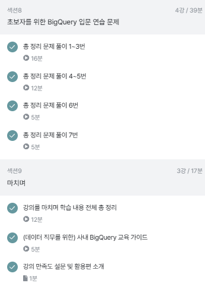

# 8주차 과제 

## 총 정리 문제 풀이 

### 1번 

* 문제 : 각 트레이너별로 가진 포켓몬의 평균 레벨을 계산하고, 그 중 평균 레벨이 높은 TOP3 트레이너의 이름과 보유한 포켓몬의 수, 평균 레벨을 출력해주세요. 

```sql

WITH trainer_avg_level AS (
SELECT
  DISTINCT 
    trainer_id,
    ROUND(AVG(level),2) AS avg_level,
    COUNT(id) AS pk_cnt
FROM basic.trainer_pokemon
WHERE
  status != "Released" 
GROUP BY
  trainer_id
)
SELECT
  t.name,
  tal.avg_level,
  tal.pk_cnt
FROM basic.trainer AS t
LEFT JOIN trainer_avg_level AS tal
ON t.id=tal.trainer_id
ORDER BY
  avg_level DESC
LIMIT 3
;

# WITH 구문 활용 .
# DISTINCT 활용 -> 중복 유의.

```


### 2번 

* 문제 : 각 포켓몬 타입1을 기준으로 가장 많이 포획된(방출 여부 상관없음) 포켓몬의 타입1, 포켓몬의 이름과 포획 횟수를 출력해주세요.


```sql

SELECT
  type1,
  kor_name,
  COUNT(tp.id) AS cnt
FROM basic.trainer_pokemon AS tp
LEFT JOIN basic.pokemon AS p
ON tp.pokemon_id=p.id
GROUP BY
  type1,
  kor_name
ORDER BY
  cnt DESC
LIMIT 3 
;

```
### 3번 

* 문제 :  전설의 포켓몬을 보유한 트레이너들은 전설의 포켓몬과 일반 포켓몬을 얼마나 보유하고 있을까요? (트레이너의 이름을 같이 출력해주세요)

```sql

WITH legendary_cnts AS (
  SELECT
    tp.trainer_id,
    SUM(CASE WHEN p.is_legendary IS True THEN 1 ELSE 0 END) AS lgd_cnt,-- 'IS True' 생략 가능, '= True'로도 표현 가능
    SUM(CASE WHEN p.is_legendary IS False THEN 1 ELSE 0 END) AS nml_cnt -- 'IS NOT TRUE', 'CASE WHEN NOT~THEN'도 가능
  FROM basic.trainer_pokemon AS tp
  LEFT JOIN basic.pokemon AS p
  ON tp.pokemon_id=p.id
  GROUP BY tp.trainer_id
)
# legendary_cnts + trainer
SELECT
  t.name AS trainer_name,
  lc.lgd_cnt,
  lc.nml_cnt
FROM basic.trainer AS t
LEFT JOIN legendary_cnts AS lc
ON t.id = lc.trainer_id
WHERE
  lc.lgd_cnt >= 1
;

# WITH 구문 활용도 중요!!
```

### 4번 

* 문제 : 가장 승리가 많은 트레이너 ID, 트레이너의 이름, 승리한 횟수, 보유한 포켓몬의 수, 평균 포켓몬의 레벨을 출력해주세요. 단, 포켓몬의 레벨은 소수점 둘째 자리에서 반올림해주세요. (참고: 반올림 함수 ROUND)

```sql

WITH winner_counts AS (
  # 1) winner_id, COUNT(승리 횟수)
  SELECT
    winner_id,
    COUNT(winner_id) AS win_count
  FROM basic.battle
  WHERE
    winner_id IS NOT NULL
  GROUP BY
    winner_id
), 

top_winner AS (
  # 2) 이름 추가
  SELECT
    wc.winner_id AS trainer_id,
    wc.win_count,
    t.name AS trainer_name
  FROM winner_counts AS wc
  LEFT JOIN basic.trainer AS t
  ON wc.winner_id = t.id
  ORDER BY
    win_count DESC
  LIMIT 1
)

# 3) 평균 포켓몬 레벨, 포켓몬 수 추가
SELECT
  tw.trainer_id,
  tw.trainer_name,
  tw.win_count,
  COUNT(tp.pokemon_id) AS pk_cnt,
  ROUND(AVG(tp.level),2) AS avg_level
FROM top_winner AS tw
LEFT JOIN basic.trainer_pokemon AS tp
ON tw.trainer_id = tp.trainer_id
WHERE
  tp.status IN ("Active", "Training")
GROUP BY
  tw.trainer_id,
  tw.trainer_name,
  tw.win_count

# WITH 구문 활용도 중요!!
```
### 5번 

* 트레이너가 잡았던 포켓몬의 총 공격력(attack)과 방어력(defense)의 합을 계산하고, 이 합이 가장 높은 트레이너를 찾으세요.

```sql

WITH total_stats AS (
  SELECT
    tp.trainer_id,
    SUM(p.attack+p.defense) AS total_stat
  FROM basic.trainer_pokemon AS tp
  LEFT JOIN basic.pokemon p
  ON tp.pokemon_id=p.id
  GROUP BY
    tp.trainer_id
)

SELECT
  t.name,
  ts.trainer_id,
  ts.total_stat
FROM total_stats AS ts
LEFT JOIN basic.trainer AS t
ON ts.trainer_id = t.id
ORDER BY total_stat DESC
LIMIT 1
;

```

### 6번 

* 각 포켓몬의 최고 레벨과 최저 레벨을 계산하고, 레벨 차이가 가장 큰 포켓몬의 이름을 출력하세요.

```sql

WITH level_diff AS (
  SELECT
    tp.pokemon_id,
    p.kor_name,
    MAX(level) AS max_level,
    MIN(level) AS min_level,
    MAX(level)-MIN(level) AS level_difference
  FROM basic.trainer_pokemon as tp
  LEFT JOIN basic.pokemon AS p
  ON tp.pokemon_id=p.id
  GROUP BY
    tp.pokemon_id,
    p.kor_name
)
SELECT
  kor_name,
  level_difference
FROM level_diff
ORDER BY
  level_difference DESC
LIMIT 1
;

```

### 7번 

* 각 트레이너가 가진 포켓몬 중에서 공격력(attack)이 100 이상인 포켓몬과 100 미만인 포켓몬의 수를 각각 계산해주세요. 트레이너의 이름과 두 조건에 해당하는 포켓몬의 수를 출력해주세요.

```sql

WITH active_and_training_pokemon AS (
  SELECT
    *
  FROM basic.trainer_pokemon
  WHERE
    status IN ("Active", "Training")
),
trainer_high_and_low_attack_cnt AS (
  SELECT
    atp.trainer_id,
    COUNTIF(p.attack >= 100) AS high_attack_cnt,
    COUNTIF(p.attack < 100) AS low_attack_cnt
  FROM active_and_training_pokemon AS atp
  LEFT JOIN basic.pokemon AS p
  ON atp.pokemon_id = p.id
  GROUP BY
    atp.trainer_id
)
SELECT
  t.name,
  thala.*
FROM trainer_high_and_low_attack_cnt AS thala
LEFT JOIN basic.trainer AS t
ON thala.trainer_id=t.id
;

# WITH 구문을 잘 활용하는 연습!!

```

### 총정리

* 데이터 활용 과정 

* 데이터 탐색 : 조건과 추출(SELECT -> FROM, WHERE) 

* 데이터 탐색 : 요약, 집계(GROUP BY, 집계함수)

* 데이터 탐색 변환 : 데이터 타입과 변환, 타입별 함수 / BigQuery 공식 문서 확인 

* 다양한 자료 연결 : JOIN 

* SQL 쿼리 작성하는 흐름
    - 쿼리 작성 템플릿, 생산성 도구 
    - 오류를 디버깅하는법

* 데이터 결과 검증 


```sql

# 쿼리문 기본구조
WITH CTE AS (
    SELECT
        col1,
        col2,
    FROM Table
)

SELECT
    a.col3,
    b.col4,
    COUNT(DISTINCT a.id) AS cnt -- unique값
FROM table_a AS a
LEFT JOIN table_b AS b
ON a.id=b.id
WHERE -- FROM 절 테이블에 바로 조건 걸기
    a.col3 >= 3
GROUP BY
    a.col3,
    b.col4
HAVING -- 집계화 후 결과에 조건 걸기
    cnt >= 2
ORDER BY cnt DESC
LIMIT 10

```


