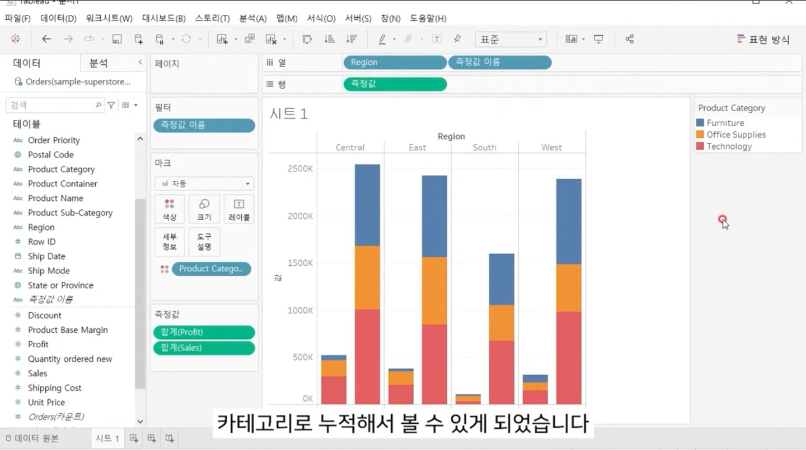
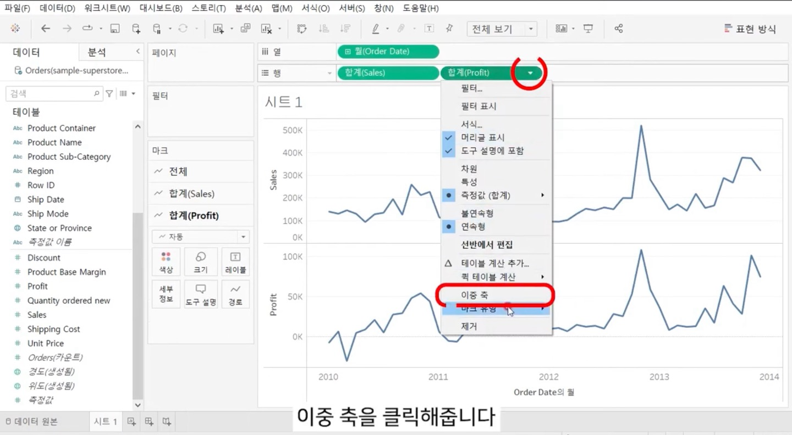
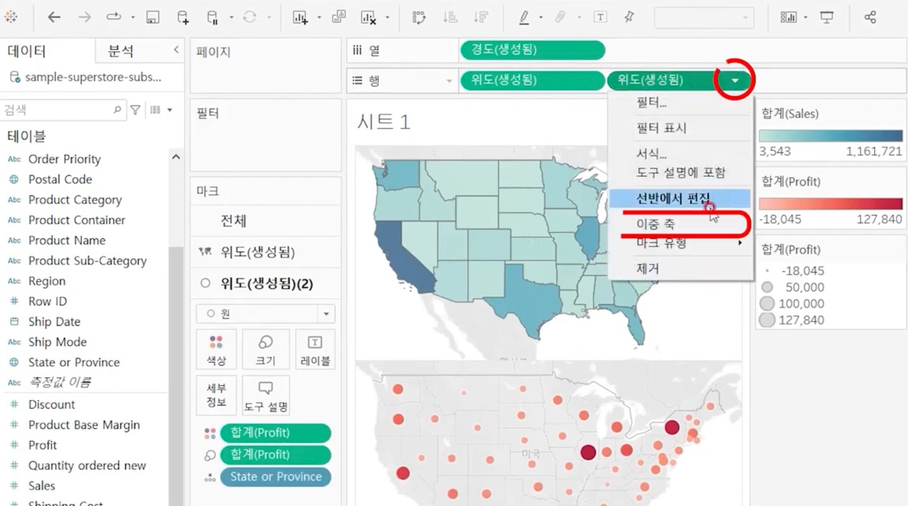

# Second Study Week

- 10강: [차원과 측정값](#10강-차원과-측정값)

- 11강: [시각화](#11강-시각화)

- 12강: [막대그래프](#12강-막대그래프)

- 13강: [누적막대그래프](#13강-누적막대그래프)

- 14강: [병렬막대그래프](#14강-병렬막대그래프)

- 15강: [누적병렬막대그래프](#15강-누적병렬막대그래프)

- 16강: [라인그래프](#16강-라인그래프)

- 17강: [맵작성](#17강-맵작성)

- 18강: [텍스트테이블](#18강-텍스트테이블)

- 19강: [트리맵과 하이라이트테이블](#19강-트리맵과-하이라이트테이블)

- 문제1 : [문제1](#문제1)

- 문제2 : [문제2](#문제2)

- 참고자료 : [참고자료](#참고-자료)


## Study Schedule

| 강의 범위     | 강의 이수 여부 | 링크                                                                                                        |
|--------------|---------|-----------------------------------------------------------------------------------------------------------|
| 1~9강        |  ✅      | [링크](https://youtu.be/3ovkUe-TP1w?si=CRjj99Qm300unSWt)       |
| 10~19강      | ✅      | [링크](https://www.youtube.com/watch?v=AXkaUrJs-Ko&list=PL87tgIIryGsa5vdz6MsaOEF8PK-YqK3fz&index=75)       |
| 20~29강      | 🍽️      | [링크](https://www.youtube.com/watch?v=AXkaUrJs-Ko&list=PL87tgIIryGsa5vdz6MsaOEF8PK-YqK3fz&index=65)       |
| 30~39강      | 🍽️      | [링크](https://www.youtube.com/watch?v=e6J0Ljd6h44&list=PL87tgIIryGsa5vdz6MsaOEF8PK-YqK3fz&index=55)       |
| 40~49강      | 🍽️      | [링크](https://www.youtube.com/watch?v=AXkaUrJs-Ko&list=PL87tgIIryGsa5vdz6MsaOEF8PK-YqK3fz&index=45)       |
| 50~59강      | 🍽️      | [링크](https://www.youtube.com/watch?v=AXkaUrJs-Ko&list=PL87tgIIryGsa5vdz6MsaOEF8PK-YqK3fz&index=35)       |
| 60~69강      | 🍽️      | [링크](https://www.youtube.com/watch?v=AXkaUrJs-Ko&list=PL87tgIIryGsa5vdz6MsaOEF8PK-YqK3fz&index=25)       |
| 70~79강      | 🍽️      | [링크](https://www.youtube.com/watch?v=AXkaUrJs-Ko&list=PL87tgIIryGsa5vdz6MsaOEF8PK-YqK3fz&index=15)       |
| 80~89강      | 🍽️      | [링크](https://www.youtube.com/watch?v=AXkaUrJs-Ko&list=PL87tgIIryGsa5vdz6MsaOEF8PK-YqK3fz&index=5)        |


<!-- 여기까진 그대로 둬 주세요-->
<!-- 이 안에 들어오는 텍스트는 주석입니다. -->

# Second Study Week

## 10강: 차원과 측정값

<!-- 차원과 측정값에 관해 배우게 된 점을 적어주세요 -->

* 차원 : 독립적인 값 

* 측정값 : 차원의 세부항목

> **🧞‍♀️ 차원과 측정값의 고유한 특성에 대해 설명해주세요.**

```

 차원으로 분류되는 데이터는 정성적인 값을 가지고 있는 필드입니다. 집계되거나 개선되지 않는 독립적인 필드라는 특징을 가지고 있습니다.

 측정값으로 분류되는 데이터는 정량적인 값을 가지고 있는 필드입니다. 매출이나 수익, 수령 등 집계될 수 있는 특징을 가지고 있습니다. 

```

*Quiz: 차원은 불연속형이고, 측정값은 연속형이다 (o, x)*

* 기본적으로 차원은 불연속형 필드, 측정값은 연속형 필드로 분류

* 항상 그런것은 아니다 

정답 : x 

## 11강: 시각화

<!-- 시각화 관해 배우게 된 점을 적어주세요 -->

* 데이터 필드를 시트에 추가 : 더블 클릭 or 드래그 앤 드랍


*Quiz: 차원은 대부분 불연속형이며 표 형태로 시각화했을 때 머리글로 표시되고, 측정값은 대부분 연속형이므로 표 형태로 시각화 진행했을 때 패널로 추가된다.(o, x)*


정답 : 0 


## 12강: 막대그래프

<!-- 막대그래프에 관해 배우게 된 점을 적어주세요 -->

### 내림차순 정렬 

* 자동으로 내림차순 정렬


-> 옆 키는 오름차순 정렬, 그 옆에 키는 행렬 순서 바꿔주는 키 

* 수동으로 내림차순 정렬


## 13강: 누적막대그래프

<!-- 누적막대그래프에 관해 배우게 된 점을 적어주세요 -->

### 누적막대 그래프 만들기 

* 누적 막대 그래프 생성하기 


* 누적 막대 그래프에 색상 입히기 


* 누적 막대 그래프에 구성비율 적기 


* 구성비율 표에 반영하기


<!-- 테이블(아래로)와 테이블(옆으로)의 계산 방식을 습득해보세요. 이에 관련해 아래 참고자료도 있습니다 :) -->

## 14강: 병렬막대그래프

<!-- 병렬막대그래프에 관해 배우게 된 점을 적어주세요 -->

* 태블로 자동적으로 연속형과 불연속형 설정 

* 날짜는 기본적으로 불연속형 필드

* 병렬 그래프를 그릴 때 필드를 연속형으로 설정해야 각 막대의 수평위치를 고려하여 그룹을 형성 가능 

* 불연속형을 연속형으로 바꾸는 방법 

1) 테이블 원본에서 바꾸는 방법 -> 표시하려는 뷰에서 데이터 유형을 변경하는 것 추천

2) 선반에서 데이터 유형 바꾸기


> *🧞‍♀️ 끊어진 색상으로 배치되어 표현되는 경우와 이어지는 그라데이션 색으로 표현되는 경우 두 가지가 있습니다. 위 사진의 경우 왜 색깔이 끊어지는 색상으로 표시되지 않고 그라데이션으로 표시되었나요? 데이터의 특성과 관련하여 이야기해 봅시다.*

```
데이터가 연속형이기 때문에 그라데이션으로 나타납니다. 
```

## 15강: 누적병렬막대그래프

<!-- 누적병렬막대그래프에 관해 배우게 된 점을 적어주세요 -->

* 누적병렬막대 그래프 만드는 방법 


* 카테고리로 누적한 그래프 만들기


* 이중 축 만들기


> *🧞‍♀️ 위 사진에서는 Profit과 Sales를 측정값으로 두었습니다.  개별 칼럼(태블로에서는 #필드라 명칭합니다)을 열/행에 두는 대신, '측정값'을 사용하고 측정값 선반에 필드를 올려둡니다. 이런 방식을 사용하는 이유가 무엇일지, 어떻게 사용할 수 있을지 고민해보세요*

```
profit과 sales라는 2개의 측정값을 하나로 표시하기 위해서 행 선반에 "측정값"을 사용했습니다. 
```

<!-- 정답은 없습니다 -->

## 16강: 라인그래프

<!-- 라인그래프에 관해 배우게 된 점을 적어주세요 -->

* 라인그래프 : 데이터의 시간별 추세롤 확인, 데이터를 통해 미래 값을 예측하려는 경우에 많이 사용

* 두 그래프 비교 : 이중 축 활용 

* 데이터 형태 : 연속형으로 바꿔주기 


* 두가지 차트를 한번에 표시하기(이중축 활용)



* 두 데이터를 비교한다면 축 동기화!(추이만 확인할거면 굳이?)


## 17강: 맵작성

<!-- 맵차트 관해 배우게 된 점을 적어주세요 -->

* 맵 차트 : 지리적 분석에 유용한 맵 작성 가능 

* 경도와 위도 좌표가 있는 위치 데이터를 가지고 있으면 태블로의 지리적 역할을 통해 간단히 앱을 그릴 수 있음 

* 텍스트 만으로 지도 표현 가능 

* 태블로에서 지리적 역할을 부여하면 위도와 경도가 자동으로 생성되어 원하는 맵을 그릴 수 있음

* 우리나라의 경우 시/도, 구/군 정도만 제공해줌, 더 하위의 행정구역을 표현하기 위해서는 해당 구역이 그려진 공간파일을 따로 태블로 연결 필요 

* 위치 기반 확인(지리적 역할 키)


* 간단한 맵 차트 만들어보기 

![My Image][def]


* 두가지 데이터 표시 한꺼번에(이중축 활용)


```js
## 참고
Country/Region - 나라/지역
State/Province - 시/도
City - 시
County - 군
Postal Code - 우편번호
Area Code - 지역 코드
Airport - 공항
MSA/CBSA (Metropolitan Statistical Area) - 광역 통계 지역
Longitude - 경도
Latitude - 위도
```

## 18강: 텍스트테이블

<!-- 텍스트테이블에 관해 배우게 된 점을 적어주세요-->

* 텍스트테이블 : 일반적으로 보는 표 형식 

* 태블로에서는 행과 열 선반에 차원을 배치하여 텍스트 태이블을 만듦 

* 간단한 텍스트 데이블 만들어보기


* 


## 19강: 트리맵과 하이라이트테이블

> *🧞‍♀️하이라이트 테이블 등에서 두개 이상의 측정값을 사용하는 경우, 함께 색을 표현하게 되면 단위가 달라 정확한 값을 표현할 수 없습니다. 이때 클릭해야 하는 항목은?*

```
별도의 범례 항목을 클릭해야합니다. 
```


## 문제1

```js
지민이는 superstore의 한국 수출 관리 업무를 맡고 있습니다. 국가/지역이 우리나라, 즉 'South Korea'인 데이터만을 필터링하여, 상품 하위범주 별로 각 하위범주가 매출의 비율 중 얼마만큼을 차지하는지를 트리맵으로 확인하고 싶습니다. 트리맵의 각 네모 안에 표시되는 텍스트에는 **해당 범주의 이름과 전체에서 해당 범주가 차지하는 비율**이 표시되었으면 합니다.

지민이를 도와주세요! (풀이를 찾아가는 과정을 기술해주세요)
```

```
1. 국가 / 지역 필드를 필터에 드래그 드랍 후 "South Korea" 선택 

2. 매출 & 하위범주 필드를 필터에 매출은 색상, 크기로 각각 선택하고 하위범주는 래이블로 드래그 드랍

```


```
3. 매출 필드를 필터 레이블에 드래그 드랍 후 퀵테이블에서 구성비율 선택 

```

## 문제2

```js
주현이는 국가/지역별로 매출과 수익의 증감을 시간에 흐름에 따라 표현하고자 합니다. 특히 **한국/중국/일본**을 비교하고자 해당 3국을 남기고 필터링했고, 3개 국가를 매출과 수익이라는 두 가지 지표로 확인해보았습니다.

아래는 위 설명을 표현해본 예시입니다.
```


```
1. 필터에 'South Korea', 'China', 'Japan' 필터링 

2. 열에 국가/지역 필드와 주문 날짜 필드를 연속형으로 변환하고 드래그 앤 드랍 

```


```
3. 매출과 수익 필드를 이중 축 사용 
```


### 참고 자료

```js
테이블 계산에서 '다음을 사용하여 계산'에는 테이블 당 계산과 패널 당 계산이 있습니다. 이에 대해 이해하는 것이 꼭 필요하기 때문에, 외부 레퍼런스를 참고하여 이 단계에서 꼭! 학습 후, 넘어가주세요 :)
```


[참고 외부자료 링크는여기를클릭하십시다](https://velog.io/@eunsuh/Tableau-%EB%A0%88%EB%B2%A8UP-%EA%B0%95%EC%9D%98-%EC%A0%95%EB%A6%AC-1-%ED%85%8C%EC%9D%B4%EB%B8%94-%EA%B3%84%EC%82%B0)


[def]: image/KakaoTalk_20240923_112446811_01.jpg