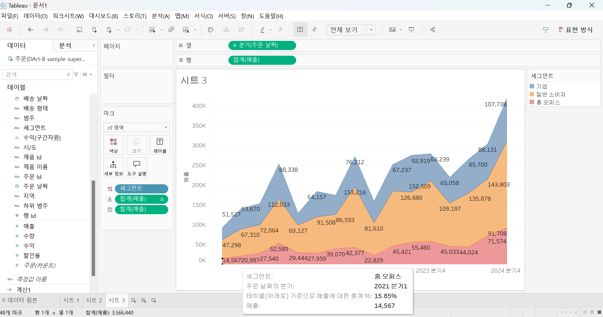

# Third Study Week

- 20강: [파이와 도넛차트](#20강-파이와-도넛차트)

- 21강: [워드와 버블차트](#21강-워드와-버블차트)

- 22강: [이중축과 결합축](#22강-이중축과-결합축)

- 23강: [분산형 차트](#23강-분산형-차트)

- 24강: [히스토그램](#24강-히스토그램)

- 25강: [박스플롯](#25강-박스플롯)

- 26강: [영역차트](#26강-영역차트)

- 27강: [간트차트](#27강-간트차트)

- 28강: [필터](#28강-필터)

- 29강: [그룹](#29강-그룹)


- 문제1 : [문제1](#문제1)

- 문제2 : [문제2](#문제2)

- 참고자료 : [참고자료](#참고-자료)


## Study Schedule

| 강의 범위     | 강의 이수 여부 | 링크                                                                                                        |
|--------------|---------|-----------------------------------------------------------------------------------------------------------|
| 1~9강        |  ✅      | [링크](https://youtu.be/3ovkUe-TP1w?si=CRjj99Qm300unSWt)       |
| 10~19강      | ✅      | [링크](https://www.youtube.com/watch?v=AXkaUrJs-Ko&list=PL87tgIIryGsa5vdz6MsaOEF8PK-YqK3fz&index=75)       |
| 20~29강      | ✅      | [링크](https://www.youtube.com/watch?v=Qcl4l6p-gHM)      |
| 30~39강      | 🍽️      | [링크](https://www.youtube.com/watch?v=e6J0Ljd6h44&list=PL87tgIIryGsa5vdz6MsaOEF8PK-YqK3fz&index=55)       |
| 40~49강      | 🍽️      | [링크](https://www.youtube.com/watch?v=AXkaUrJs-Ko&list=PL87tgIIryGsa5vdz6MsaOEF8PK-YqK3fz&index=45)       |
| 50~59강      | 🍽️      | [링크](https://www.youtube.com/watch?v=AXkaUrJs-Ko&list=PL87tgIIryGsa5vdz6MsaOEF8PK-YqK3fz&index=35)       |
| 60~69강      | 🍽️      | [링크](https://www.youtube.com/watch?v=AXkaUrJs-Ko&list=PL87tgIIryGsa5vdz6MsaOEF8PK-YqK3fz&index=25)       |
| 70~79강      | 🍽️      | [링크](https://www.youtube.com/watch?v=AXkaUrJs-Ko&list=PL87tgIIryGsa5vdz6MsaOEF8PK-YqK3fz&index=15)       |
| 80~89강      | 🍽️      | [링크](https://www.youtube.com/watch?v=AXkaUrJs-Ko&list=PL87tgIIryGsa5vdz6MsaOEF8PK-YqK3fz&index=5)        |


<!-- 여기까진 그대로 둬 주세요-->
<!-- 이 안에 들어오는 텍스트는 주석입니다. -->

# Third Study Week

## 20강: 파이와 도넛차트
<!-- 파이와 도넛차트에 관해 배우게 된 점을 적어주세요 -->

### 파이차트 

* 전체에 대한 비율을 표시할 때 주로 사용 

> **🧞‍♀️ 도넛차트를 생성하는 법을 기록해주세요.**

* 구성비율을 표시하는 도넛차트 생성하기 


* 이중축을 활용한 도넛차트 만들기 


## 21강: 워드와 버블차트
<!-- 워드와 버블차트에 관해 배우게 된 점을 적어주세요 -->

### 버블차트 

* 수치적 데이터를 원의 크기로 표현하는 차트 

* 지역과 매출에 따른 버블 차트 만들기


### 워드 클라우드 

* 문서 내에 등장하는 키워드가 얼마나 자주 등장하는지를 텍스트 크기로 표현하여 직관적으로 시각화할 수 있는 차트 

* 데이터에서 어떤 지역이 몇번 등장하였는지 횟수를 카운트하고 이에 따른 크기를 표현하는 워드 클라우드 만들기 


## 22강: 이중축과 결합축
<!-- 이중축과 결합축에 관해 배우게 된 점을 적어주세요 -->

### 이중축 

* 하나의 뷰어 안에서 축을 이중으로 사용하는 차트 

* 마크를 각각 개별적으로 적용 가능 


### 결합축 

* 하나의 축을 공유하는 차트 

* 축을 공유하는 측정값을 필요에 따라 추가 가능 


## 23강: 분산형 차트
<!-- 분산형 차트에 관해 배우게 된 점을 적어주세요 -->

```js
강의 영상과 달리, 우리 파일에는 '제조 업체' 필드가 없습니다. 필요한 경우, 계산된 필드를 이용해 'SPLIT([제품 이름], ' ', 1)'를 '제조 업체'로 정의하시고 세부 정보에 놓아주세요.
```

* 파라미터간의 상관관계를 파악하는데 유용한 그래프 

* 추세선 자주 활용 

* 매출과 수익 간의 상관관계 파악 

* 추세선을 활용한 분산형 차트 만들어보기 


## 24강: 히스토그램
<!-- 히스토그램에 관해 배우게 된 점을 적어주세요 -->

* 분포 형태를 표시하는 차트 

* 연속형 측정값을 범위 혹은 구간 차원으로 그룹화한다는 점에서 막대그래프와 차이가 있음 

* 차원 필드 없이 측정값만으로 그래프를 그릴 때 주로 사용하는 표현 방식 

* 구간 차원 : 일정한 크기의 포켓을 만들어 그 안에 값을 담아 표현시키기 위한 도구 

#### 구간 차원 생성한 히스토그램 만들기 


#### 구간 차원 생성하지 않고 수익에 대한 히스토그램 만들기 

* 위에서 했던 작업들이 표현방식에서 히스토그램을 클릭해주는 것으로 자동 실행되었음을 알 수 있음 


## 25강: 박스플롯
<!-- 박스플롯에 관해 배우게 된 점을 적어주세요 -->

* 박스플롯 개념 설명 


* 매출을 표시하는 박스플롯 만들어보기 


## 26강: 영역차트
<!-- 영역차트에 관해 배우게 된 점을 적어주세요 -->

* 라인과 축 사이의 공간이 색상으로 채워진 라인 차트 

* 연속형 데이터의 누계를 표현하는데 사용

#### 주문날짜에서 분기별로 매출 살펴보기 



## 27강: 간트차트
<!-- 간트차트에 관해 배우게 된 점을 적어주세요 -->

* 시간 경과에 따른 기간을 시각화하는데 사용 

* 제품 범주별 배송 기간을 배송 형태로 구분해서 간트 차트로 시각화해보기 


## 28강: 필터
<!-- 필터에 관해 배우게 된 점을 적어주세요 -->

* 데이터 분석에서 필수적인 부분 

* 뷰뿐만 아니라 쿼리 속도나 데이터 용량 측면에서도 필터 핸들링에 따라 성능의 차이가 많이 남 

* 데이터 원본 필터 : 일부만 워크 스페이스에 불러올 떄 사용 

#### 컨텍스트 필터

 * 필터 중 상위 필터 
 
 * 각 필터가 다른 필터에 관계 없이 모든 행에 액세스하도록 작동하는데 여러가지 필터를 설정했을 때, 컨텍스트 필터로 지정해주게 되면 다른 필터가 컨텍스트 필터에 종속되어 작동 

 * 쿼리 속도 향상에 도움 

 * 실습 예시 


## 29강: 그룹
<!-- 그룹에 관해 배우게 된 점을 적어주세요 -->

* 데이터를 표시하는 방법 : 그룹, 계층, 집합 

* 만드는 방법(1) : 뷰에서 그룹을 만들기

* 만드는 방법(2) : 해당 그룹 필드를 마우스 우 클릭하고 "그룹 편집"을 통해 확인하기 / shift 키 활용 

* 제품과 수익을 보여주는 막대 차트 만들어보기 


## 문제 1.

```js
유정이는 superstore 데이터셋에서 '주문' 테이블을 보고 있습니다.
1) 국가/지역 - 시/도- 도시 의 계층을 생성했습니다. 계층 이름은 '위치'로 설정하겠습니다.
2) 날짜의 데이터 타입을 '날짜'로 바꾸었습니다.

코로나 시기의 도시별 매출 top10을 확인하고자
1) 배송 날짜가 코로나시기인 2021년, 2022년에 해당하는 데이터를 필터링했고
2) 위치 계층을 행으로 설정해 펼쳐두었습니다.
이때, 매출의 합계가 TOP 10인 도시들만을 보았습니다.
```


```
겉보기에는 전체 10개로, 잘 나온 결과처럼 보입니다. 그러나 유정이는 치명적인 실수를 저질렀습니다.
오늘 배운 '컨텍스트 필터'의 내용을 고려하여 올바른 풀이 및 결과를 구해주세요.
```

```
위의 오류를 수정하기 위해서 다음과 같은 과정 진행 

1. 국가/지역과 시/도 필드를 제외하고 도시 필드만을 행으로 설정 

2. 도시와 년(배송날짜)와 위 조건에 나온 필터 적용 

3. 매출 합계를 기준으로 상위 10개 도시만 내림차순 정렬
```


<!-- DArt-B superstore가 아닌 개인 superstore 파일을 사용했다면 값이 다르게 표시될 수 있습니다.-->

## 문제 2.

```js
태영이는 관심이 있는 제품사들이 있습니다. '제품 이름' 필드에서 '삼성'으로 시작하는 제품들을 'Samsung group'으로, 'Apple'으로 시작하는 제품들을 'Apple group'으로, 'Canon'으로 시작하는 제품들을 'Canon group'으로, 'HP'로 시작하는 제품들을 'HP group', 'Logitech'으로 시작하는 제품들을 'Logitech group'으로 그룹화해서 보려고 합니다. 나머지는 기타로 설정해주세요. 이 그룹화를 명명하는 필드는 'Product Name Group'으로 설정해주세요.

(이때, 드래그보다는 멤버 찾기 > 시작 문자 설정하여 모두 찾아 한번에 그룹화해 확인해보세요.)
```


```js
해당 그룹별로 어떤 국가/지역이 주문을 많이 차지하는지를 보고자 합니다. 매출액보다는 주문량을 보고 싶으므로, 주문Id의 카운트로 계산하겠습니다.

기타를 제외하고 지정한 5개의 그룹 하위 목들만을 이용해 아래와 같이 지역별 누적 막대그래프를 그려봐주세요.
```


```
<문제풀이>

1. 위의 조건에 따라 그룹화를 진행하고 표에 필터값에는 기타를 제외한 5개 항목만 출력하도록 설정 

2. 열에는 카운트(주문ID), 열에는 Product Name Group 필드를 배치

3. 색상에 국가/지역 필드를 넣어 그래프 생성
```

