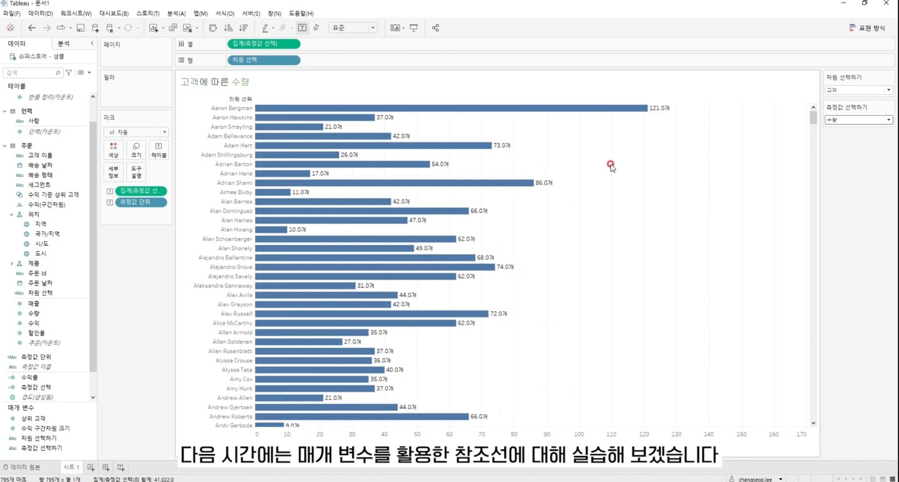
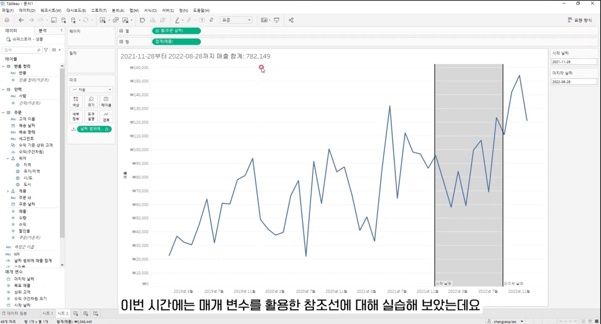
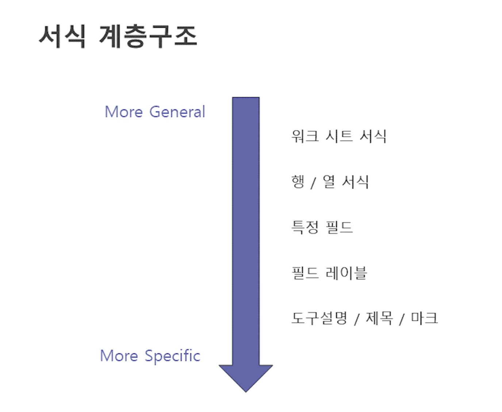
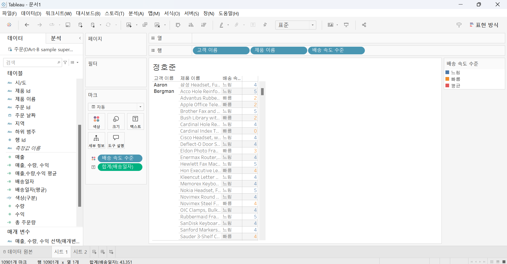
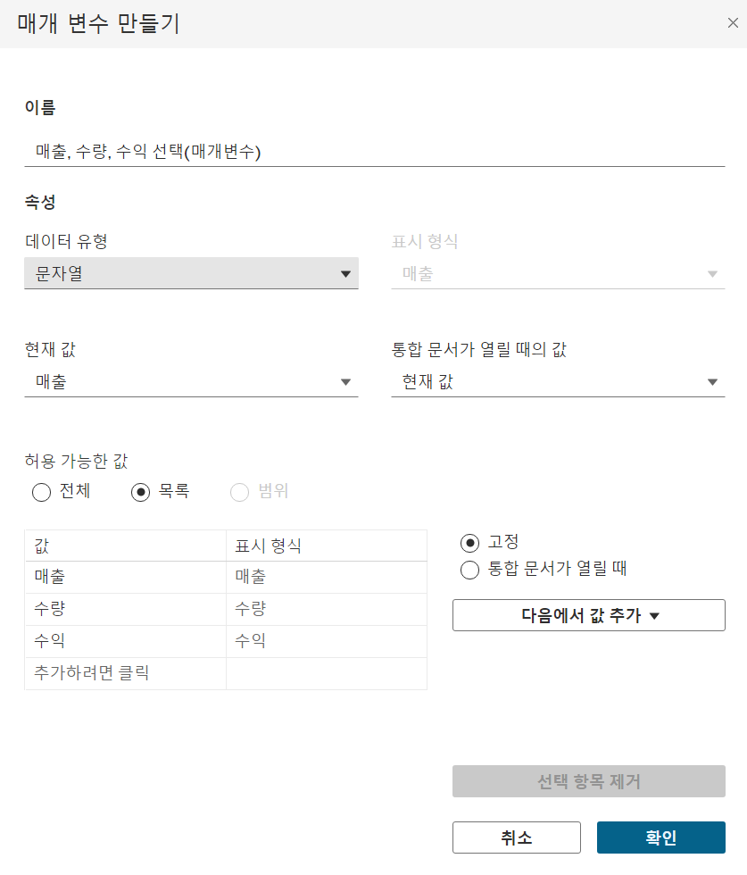
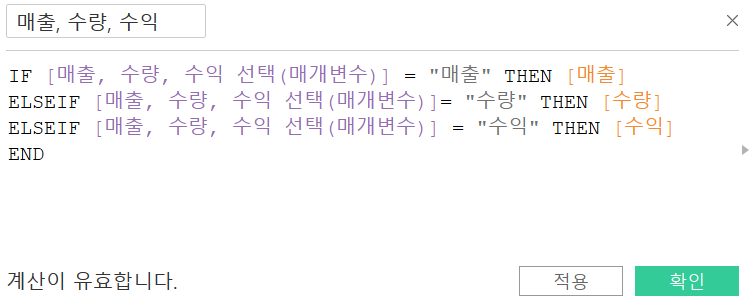
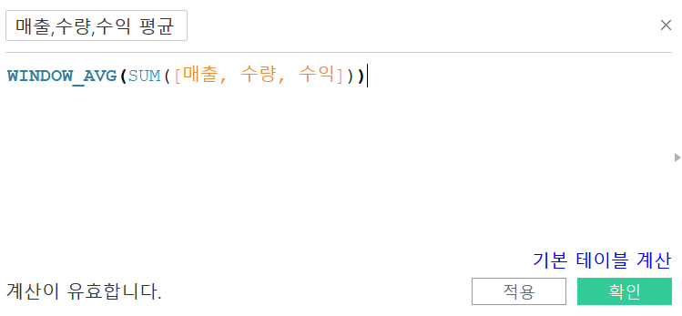
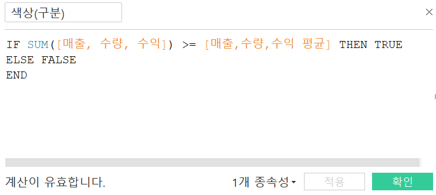
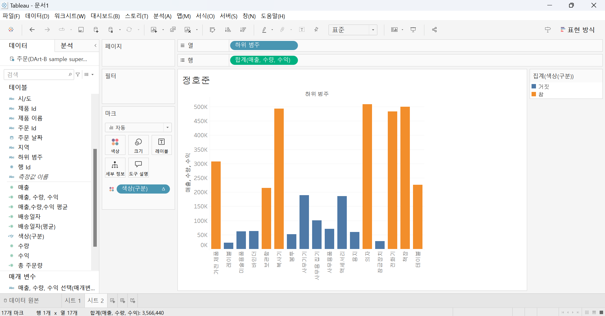

# Fifth Study Week

- 39강: [LOD](#39강-lod)

- 40강: [EXCLUDE](#40-lod-exclude)

- 41강: [INCLUDE](#41-lod-include)

- 42강 : [매개변수](#42-매개변수)

- 43강 : [매개변수 실습](#43-매개변수-실습) 


- 44강: [매개변수 실습](#44-매개변수-실습)

- 45강: [마크카드](#45-워크시트-마크카드)

- 46강: [서식계층](#46-서식-계층)

- 47강: [워크시트](#47-워크시트-서식)

- [문제1](#문제-1)

- [문제2](#문제-2)

## Study Schedule

| 강의 범위     | 강의 이수 여부 | 링크                                                                                                        |
|--------------|---------|-----------------------------------------------------------------------------------------------------------|
| 1~9강        |  ✅      | [링크](https://www.youtube.com/watch?v=AXkaUrJs-Ko&list=PL87tgIIryGsa5vdz6MsaOEF8PK-YqK3fz&index=84)       |

| 10~19강      | ✅      | [링크](https://www.youtube.com/watch?v=AXkaUrJs-Ko&list=PL87tgIIryGsa5vdz6MsaOEF8PK-YqK3fz&index=75)       |
| 20~29강      | ✅      | [링크](https://www.youtube.com/watch?v=AXkaUrJs-Ko&list=PL87tgIIryGsa5vdz6MsaOEF8PK-YqK3fz&index=65)       |
| 30~38강      | ✅      | [링크](https://www.youtube.com/watch?v=e6J0Ljd6h44&list=PL87tgIIryGsa5vdz6MsaOEF8PK-YqK3fz&index=55)       |
| 39~47강      | ✅      | [링크](https://www.youtube.com/watch?v=AXkaUrJs-Ko&list=PL87tgIIryGsa5vdz6MsaOEF8PK-YqK3fz&index=45)       |
| 48~59강      | 🍽️      | [링크](https://www.youtube.com/watch?v=AXkaUrJs-Ko&list=PL87tgIIryGsa5vdz6MsaOEF8PK-YqK3fz&index=35)       |
| 60~69강      | 🍽️      | [링크](https://www.youtube.com/watch?v=AXkaUrJs-Ko&list=PL87tgIIryGsa5vdz6MsaOEF8PK-YqK3fz&index=25)       |
| 70~79강      | 🍽️      | [링크](https://www.youtube.com/watch?v=AXkaUrJs-Ko&list=PL87tgIIryGsa5vdz6MsaOEF8PK-YqK3fz&index=15)       |
| 80~89강      | 🍽️      | [링크](https://www.youtube.com/watch?v=AXkaUrJs-Ko&list=PL87tgIIryGsa5vdz6MsaOEF8PK-YqK3fz&index=5)        |


<!-- 여기까진 그대로 둬 주세요-->

> **🧞‍♀️ 오늘의 스터디는 지니와 함께합니다.**


## 39강. LOD

<!-- INCLUDE, EXCLUDE, FIXED 등 본 강의에서 알게 된 LOD 표현식에 대해 알게 된 점을 적어주세요. -->

* LOD(Level of Detail) 

    *  뷰의 세부 수준을 나타냄

    * Tableau에서 LOD 표현식은 현재 뷰에는 영향을 받지 않고 본인이 원하는 세부 수준에서 계산을 수행할 수 있음 
    
    * 계산할 수준을 세부적으로 제어 가능하도록 함

* FIXED LOD
    *  현재 뷰에 있는 차원과 상관없이 계산된 필드에서 원하는 차원을 따라 게산

    1) FIXED에서 설정한 차원이 뷰에 포함되어있을 때, 
    * 지역별 매출
    -> { FIXED [지역] : SUM([매출])}

    2) FIXED에서 설정한 차원이 뷰에 포함되어 있지 않을 때
    -> { FIXED [범주] : SUM([매출])}


## 40. LOD EXCLUDE

<!-- INCLUDE, EXCLUDE, FIXED 등 본 강의에서 알게 된 LOD 표현식에 대해 알게 된 점을 적고, 아래 두 질문에 답해보세요 :) -->

* EXCLUDE LOD

    * 현재 뷰에서 특정 차원을 제외하여 계산할 때 사용

* 범주형 매출(FIXED)
-> { FIXED [범주] : SUM([매출])}

* 범주형 매출(EXCLUDE)
-> { EXCLUDE [하위범주] : SUM([매출])}


> **🧞‍♀️ FIXED와 EXCLUDE을 사용하는 경우의 차이가 무엇인가요?**

```
1. FIXED는 설정한 필드의 값만을 기준으로 집계를 고정하므로, 뷰의 다른 차원들이 영향을 주지 않는다.

2. EXCLUDE는 집계에서 특정 차원을 제외하여 계산하므로, 설정된 차원 외에 뷰에 추가된 다른 차원들이 집계에 영향을 주는 것이 가능하다.

```

> **🧞‍♀️ 왜 ATTR 함수를 사용하나요?**

```
* EXCLUDE를 사용하여 만든 계산된 필드는 뷰에 추가된 다른 차원들이 집계에 영향을 미쳐 특정 조건이나 상황에서 여러 값들의 반환될 수 있다는 단점이 있음. 따라서 하위범주 수준에서 계산하려면 집계 수준을 맞춘 뒤 계산하기 때문에  ATTR 함수를 사용한다.
```

## 41. LOD INCLUDE

<!-- INCLUDE, EXCLUDE, FIXED 등 본 강의에서 알게 된 LOD 표현식에 대해 알게 된 점을 적고, 아래 두 질문에 답해보세요 :) -->

* INCLUDE LOD 
    * 현재의 뷰에서 특정 차원을 추가하여 계산할 떄 사용 

> **🧞‍♀️ 그렇다면 어떤 경우에 각 표현식을 사용하나요? 예시와 함께 적어보아요**


```
- FIXED LOD : 뷰에 표시되는 값이 차원인 경우 (FIXED LOD는 차원, 측정값을 반환)
- INCLUDE, EXCLUDE LOD : 반환 값이 차원 필터의 영향을 받게 되는 경우 (측정값만 반환)

* FIXED LOD
    * 특정 차원을 기준으로 고정된 값을 계산
    * 차원과 측정값 모두를 반환 

ex) 각 지역별 총 매출을 계산할 때 FIXED [Region] : SUM([Sales])를 사용하면 뷰에 추가된 필드와 관계없이 지역별로 고정된 매출 값이 표시됨

* EXCLUDE LOD 
    *  반환값이 차원 필터의 영향을 받게 되어 측정값만 반환함

ex) 범주별 전체 매출을 계산하면서 특정 범주를 제외하고 집계하고자 할 때 EXCLUDE [Category] : SUM([Sales])를 사용하면 Category를 제외한 상태에서 매출 합계를 계산할 수 있으며, 차원 필터에 따라 해당 값을 변경할 수 있음

* INCLUDE LOD 
    * 계산 시 특정 차원을 추가로 포함해 계산, 
    * 반환값이 차원 필터의 영향을 받게 되어 측정값만 반환함

ex) 각 고객별 평균 매출을 계산할 때, 고객별 세부 집계를 포함하고 싶다면 INCLUDE [Customer ID] : AVG([Sales])를 사용하여 Customer ID를 기준으로 고객별 평균 매출을 계산할 수 있으며, 차원 필터에 따라 해당 값을 변경할 수 있음

```

## 42. 매개변수

<!-- 매개변수에 대해 알게 된 점을 적어주세요 -->

* 매개변수 

    * 고정된 상수값이 아닌 동적인 값, 즉 값을 변경하기 위해서 활용하는 기능 

    * 반드시 계산식, 필터, 참조선과 함께 사용됨 

> **🧞‍♀️ 집합에도 매개변수를 적용할 수 있나요? 시도해봅시다**

가능합니다. 

## 43. 매개변수 실습
<!-- 영상 묶음에 포함되지 않아 찾기 어려우실까 링크를 아래에 첨부하겠습니다. 수강 후 삭제해주세요-->

* 방법
1. ‘상위’ 탭에서 ‘필드 기준’을 매개변수로 설정하여 만든 집합 필드 만든다.
2. 마크 카드의 색상으로 드래그 앤 드롭

3. 매개변수 값에 따라 상위 항목들이 색상으로 구분되는 것을 확인할 수 있음

 

## 44. 매개변수 실습

<!-- 매개변수에 대해 알게 된 점을 적어주세요 -->

* 매개변수를 활용한 참조선 
 
* 참조선 

-> KPI
IF SUM([매출]) >= [목표 매출]
THEN '목표 달성'
ELSE '목표 미달성'
END

* 참조구간

-> 날짜범위의 매출합계 
TOTAL(SUM(IF [주문날짜] >= [시작 날짜] AND [주문날짜] <= [마지막 날짜] THEN [매출] END))

* 사용방법 
- '분석' 패널에 '참조선'을 뷰로 드래그
- 참조선 화면 나타남
- 라인의 값을 매개변수로 설정
- 매개변수에서 값을 입력하면 해당 값에 따라 참조선이 변경
- 이렇게 생성한 계산된 필드를 마크 카드의 색상에 드래그 앤 드롭
- 참조선을 기준으로 그래프의 색상이 구분되는 것을 확인할 수 있음

## 45. 워크시트 마크카드

<!-- 마크카드에 대해 알게 된 점을 적어주세요 -->

* Tableau는 다양한 차트를 표현함과 동시에 디자인을 직관적으로 표현하는 것이 중요함

* '마크' : Tableau에 작업 영역인 워크시트에서 차트를 만들어 해당 차트에 있는 데이터들을 가리키는 말

* '마크카드' :  마크의 서식을 변경하기 위해서 활용해야 함


* 드롭다운 메뉴
    * 마크의 표현 방식 선택

* 색상 
* 크기 
* 레이블
    * 레이블의 텍스트, 폰트, 크기, 방향
* 세부 정보
* 도구 설명

## 46. 서식 계층

<!-- 서식계층에 대해 알게 된 점을 적어주세요 -->

> **🧞‍♀️ 서식계층을 일반적인 것에서 구체적인 것 순서로 기입해보세요**



```
1. 워크 시트 서식
2. 행 / 열 서식
3. 특정 필드
4. 필드 레이블
5. 도구설명 / 제목 / 마크여기에 답을 적어주세요!
```


## 47. 워크시트 서식

<!-- 워크시트 서식에 대해 알게 된 점을 적어주세요!-->

* 상단에 있는 '서식' 탭 활용 

* 글꼴
    * 워크시트 내 표시되어 있는 텍스트들의 글꼴, 색상, 크기 설정

* 맞춤
    * 워크시트 내 표시되어 있는 텍스트들의 정렬, 방향 설정

* 음영
    * 워크시트 내 표시되어 잇는 데이터 셀의 음영 적용


## 문제 리스트


## 문제 1.

```
가장 많이 주문한 사람들은 물건 배송을 빨리 받았을까요?
조건을 준수하여 아래 이미지를 만들어봆시다.
1) 국가/지역별(이하 '나라'로 통칭), 범주별로 배송일자가 다를 수 있으니 먼저, 나라별/범주별로 평균 배송일자를 설정한 뒤,
2) 각 나라에서 가장 많이 주문한 사람의 이름을 첫 번째 열,
3) 그 사람이 주문한 제품 이름을 2번째 열,
4) 각 상품이 배송까지 걸린 날 수를 표현하고
5) 그리고 만약 배송이 각 나라/범주별 평균보다 빨랐다면 '빠름', 같다면 '평균', 느리다면 '느림' 으로 print 해주세요. 
```


<!-- 여기까지 오는 과정 중 알게 된 점을 기입하고, 결과는 시트 명을 본인 이름으로 바꾸어 표시해주세요.-->

* 과정 

1. '배송일자' 생성
=> DATEDIFF('day', [주문 날짜], [배송 날짜])

2. FIXED LOD를 사용하여 국가/지역 & 범주 차원에서의 '배송일자(평균)' 생성
=> {FIXED [국가/지역], [범주] : AVG([배송일자])}

3. FIXED LOD를 사용하여 국가/지역 차원에서의 '총 주문량' 생성
=> {FIXED [국가/지역] : COUNT([주문 ID])}

4. '배송일자'와 '배송일자(평균)'을 비교하여 빠름, 평균, 느림을 나타내는 '배송 속도 수준' 생성
=> IF [배송일자] > [배송일자(평균)] THEN '느림'
   ELSEIF [배송일자] = [배송일자(평균)] THEN '평균'
   ELSEIF [배송일자] < [배송일자(평균)] THEN '빠름'
   END

5. 행 선반 => '고객 이름', '제품 이름', '배송 속도 수준'
   마크 카드 색상 => '배송 속도 수준'
   마크 카드 텍스트 => '배송일자'

6. '고객 이름'에 대해 '총 주문량'을 기준으로 상위 필터 설정

* 결과값 


## 문제 2.

```
채원이는 태블로를 쓰실 수 없는 상사분께 보고하기 위한 대시보드를 만들고 싶어요. 

제품 중분류별로 구분하되 매개변수로써 수익, 매출, 수량을 입력하면 저절로 각각 지표에 해당하는 그래프로 바뀌도록 설계하고자 해요.

 어떤 값이 각 지표의 평균보다 낮은 값을 갖고 있다면 색깔을 주황색으로, 그것보다 높다면 파란색으로 표시하고 싶어요. 그 평균값은 각 지표별로 달라야 해요.
```

* 과정 

1. 매출, 수량, 수익을 선택하는 매개변수 생성 




2. 1에서 생성한 매개변수를 활용한 계산된 필드 생성 



3. 위 매개변수를 활용해 계산된 필드인 매출, 수량, 수익 평균 생성



4. 평균보다 큰 값과 작은 값 구분하는 계산된 필드 생성 



5. 결과값

