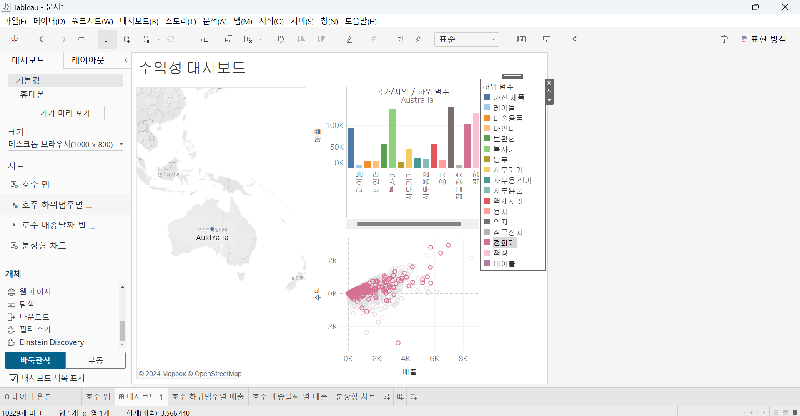

# Sixth Study Week

## Study Schedule
 

| 회차 | 강의 범위   | 강의 이수 여부 | 링크                                                                                                     |
|------|-------------|----------------|--------------------------------------------------------------------------------------------------------|
| 1    | 1~7강       | ✅              | [링크](https://www.youtube.com/watch?v=AXkaUrJs-Ko&list=PL87tgIIryGsa5vdz6MsaOEF8PK-YqK3fz&index=84)    |
| 2    | 8~17강      | ✅              | [링크](https://www.youtube.com/watch?v=AXkaUrJs-Ko&list=PL87tgIIryGsa5vdz6MsaOEF8PK-YqK3fz&index=75)    |
| 3    | 18~27강     | ✅              | [링크](https://www.youtube.com/watch?v=AXkaUrJs-Ko&list=PL87tgIIryGsa5vdz6MsaOEF8PK-YqK3fz&index=65)    |
| 4    | 28~37강     | ✅              | [링크](https://www.youtube.com/watch?v=e6J0Ljd6h44&list=PL87tgIIryGsa5vdz6MsaOEF8PK-YqK3fz&index=55)    |
| 5    | 38~47강     | ✅              | [링크](https://www.youtube.com/watch?v=AXkaUrJs-Ko&list=PL87tgIIryGsa5vdz6MsaOEF8PK-YqK3fz&index=45)    |
| 6    | 48~57강     | ✅              | [링크](https://www.youtube.com/watch?v=AXkaUrJs-Ko&list=PL87tgIIryGsa5vdz6MsaOEF8PK-YqK3fz&index=35)    |
| 7    | 58~67강     | 🍽️             | [링크](https://www.youtube.com/watch?v=AXkaUrJs-Ko&list=PL87tgIIryGsa5vdz6MsaOEF8PK-YqK3fz&index=25)    |
| 8    | 68~77강     | 🍽️             | [링크](https://www.youtube.com/watch?v=AXkaUrJs-Ko&list=PL87tgIIryGsa5vdz6MsaOEF8PK-YqK3fz&index=15)    |
| 9    | 78~85강     | 🍽️             | [링크](https://www.youtube.com/watch?v=AXkaUrJs-Ko&list=PL87tgIIryGsa5vdz6MsaOEF8PK-YqK3fz&index=5)     |
---

 
<!-- 여기까진 그대로 둬 주세요-->

> **🧞‍♀️ 오늘은 강의보다 실습과 대시보드 직접 만들기가 더 중요하니, 기록보다는 사고하며 강의를 들어주세요.**

## 48. 워크시트 서식(2)

<!-- 워크시트에 관해 본 강의에서 알게 된 점을 적어주세요 -->

* 서식 탭 -> 테두리 선택 
    * 테두리 유형, 두께, 색상 선택 가능

* 서식 탭 -> 라인 선택 
    * 뷰에서 표시된 데이터의 축에 대한 라인의 모양 설정

## 49강. 대시보드패널

<!-- 대시보드패널 강의에서 알게 된 점을 적어주세요. -->

* 크기 : 현재의 대시보드의 크기 설정 
    * 고정된 크기, 자동, 범위로 설정 가능 

* 시트를 대시보드에 드래그 앤 드랍 -> 대시보드에 시트가 자동으로 채워짐 

* 개체 
    * 텍스트 상자 개체 드래그 앤 드랍 -> 제목 
    * 이미지 개체 드래그 앤 드랍 -> 이미지 삽입 
    * 웹 페이지 개체 드래그 앤 드랍 -> 사이트 삽입 

## 50. 대시보드 구성방식

<!-- 알게 된 점을 적고, 아래 질문에 답해보세요 :) -->

> **🧞‍♀️ 부동과 바둑판식 방식을 차이를 중점으로 기술해보세요**

* 바둑판식 : 격자무늬 구조에 따라 개체 구성 
    * 대시보드의 크기를 변경해도 개체가 유사한 형식을 유지, 대시보드 크기를 자주 변경하는 것을 추천

* 부동 : 사용자가 원하는 대로 개체를 드래그 앤 드랍 
    * 자유롭게 추가 및 배치 가능 
    * 대시보드 크기가 자주 변경x, 그래프내 빈 공간이 많은 경우 추천 

## 51. 대시보드 컨테이너

* 컨테이너 
    * 대시보드 개체들과 워크시트들을 그룹화하고 구성화할 수 있는 공간. 
    * 개체를 대시보드에 배치하기 전 컨테이너를 먼저 배치 가능

* 종류 
    * 가로 컨테이너 : 내부 개체를 수평공간으로 배열 가능 
    * 세로 컨테이너 : 내부 개체를 수직공간으로 배열 가능 

## 52. 레이아웃 패널

* 레이아웃 패널
    * 제목 표시 : 제목 숨기기 가능
    * 부동 : 부동 개체로 변경 가능
    * 위치, 크기 : 부동 개체의 경우 개체의 위치와 크기를 픽셀 단위로 변경 가능 
    * 테두리 : 각 개체의 테두리 색, 두께 등 설정 가능
    * 백그라운드 : 개체의 백그라운드 색상 변경 가능
    * 여백 : 테두리를 기준으로 바깥쪽 또는 안쪽 여백 설정 가능
    * 항목 : 해당 대시보드의 컨테이너와 개체 확인 

## 53. 필터 동작

<!-- 필터 동작에 대해 알게 된 점을 적어주세요 -->

* 대시보드에 필터 추가하기

1. 차트 클릭 - '필터' 
    * 필터를 새로운 컨테이너 또는 대시보드 내에서 볼 수 있음 

2. 대시보드 탭 - 동작 
    * 옵션이 많은 경우, 직관적임 

* 활용 방법 
*  맵 차트 -> 필터 -> 세그먼트 : 세그먼트별로 선택하면 맵 차트에 세그먼트별로 나타남
* 필터 동작 추가로도 가능
* 원본 시트에서 선택했을 때 필터를 할 시트를 선택
* 대상 시트에서 선택했을 때 필터링 될 시트를 선택

## 54. 대시보드 하이라이터 동작

<!-- 하이라이터에 대해 알게 된 점을 적어주세요 -->

* 하이라이트 동작 : 대시보드에서 데이터를 선택했을 때 하이라이트로 구분 가능 

* 분산형 차트 먼저 제작 

* 원본 시트에서 선택할 시트 선택 

* 대상 시트에서 하이라이트로 표시될 시트 선택 

## 55. 대시보드 URL

<!-- URL에 대해 알게 된 점을 적어주세요 -->

* URL : 대시보드와 상호작용을 하면 웹 사이트로 이동할 수 있음

* 원본 시트에 URL을 삽입할 시트를 선택

* URL에 선택한 '국가/지역' 필드명이 매번 들어가야하므로 삽입을 통해 <국가/지역> 삽입

* 대시보드 탭 -> 동작 -> 동작 추가 -> URL로 이동 동작 -> 동작 실행조건(메뉴) -> URL에 삽입 메뉴를 통해 필드 삽입 가능

## 56. 대시보드 시트에 이동 동작

<!-- 대시보드 시트에 이동에 대해 알게 된 점을 적어주세요!-->

* 시트에서 이동 동작으로 이동될 시트를 새로운 대시보드에 생성

* 원본 시트에서 선택할 시트 선택 / 대상 시트에서 이동될 시트 선택 

#### < 활용 방법>

* 대시보드 탭 -> 동작 -> 동작 추가 -> 시트로 이동동작 -> 동작 실행조건(메뉴)

* 두번째 대시보드에 대한 필터도 선택 가능

* 다시 원래 대시보드로 돌아가려면?
    * 탐색 개체 삽입 -> 개체 옵션 

* 편집 단추 -> ALT 누른 채로 단추 클릭하면 대시보드 이동

## 57. 매개변수 변경 동작

<!-- 매개변수 변경 동작에 대해 알게 된 점을 적어주세요!-->

* 대시보드에 표시되는 데이터 변경 가능 

#### <활용 방법 >
* 시작 날짜와 끝 날짜를 필터링하기 위해 매개변수 생성 

* 시작 날짜와 끝 날짜 매개변수를 이용해 계산된 필드 생성 

* 과정 
    1. 변경할 시트에 매개변수 생성 
    2. 해당 매개변수를 활용한 계산된 필드 생성 
    3. 해당 필드를 필터 카드에 넣고 참 설정 
    4. 대시보드로 이동 
    5. 대시보드 탭 
    6. 동작 및 동작 추가
    7. 매개변수 변경 
    8. 동작 실행 조건(메뉴) / 원본 필드 선택, 해제할 경우의 결과 입력 

## 문제

오늘은 별도의 문제가 없습니다. 

여러 대시보드를 참고하시어, superstore 데이터를 사용해 나만의 대시보드를 제작해주세요.

**단, 워크시트 3개 이상의 그래프를 표시해야 하며 각 시트 간 상호작용성 필터 or 하이라이트 동작은 꼭 추가되어야 합니다**

#### 표 설명 

* 그래프 
    1. 맵(호주) 표시
    2. 하위범주(호주) 매출별 막대그래프 생성
    3. 매출 수익 분상형 차트 생성 

#### 하이라이터 구분(매출 하위범주별)

* 그래프 2,3, 하이라이트 

어떤 부분에 가중을 두었는지, 어떤 사용자 편의성을 고려하였는지에 대한 설명이 필요합니다.
