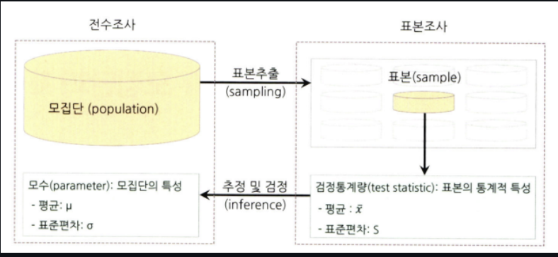
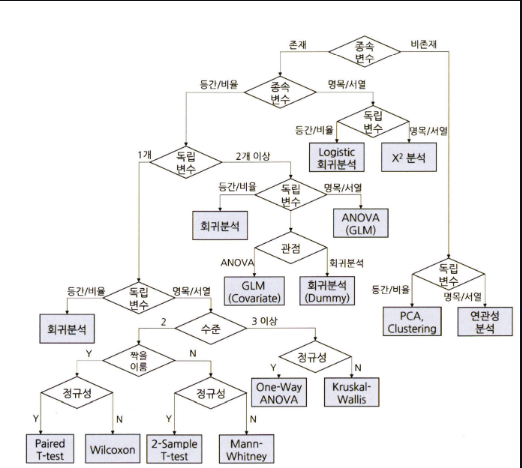

# 통계학 1주차 정규과제

📌통계학 정규과제는 매주 정해진 분량의 『*데이터 분석가가 반드시 알아야 할 모든 것*』 을 읽고 학습하는 것입니다. 이번 주는 아래의 **Statistics_1st_TIL**에 나열된 분량을 읽고 `학습 목표`에 맞게 공부하시면 됩니다.

아래의 문제를 풀어보며 학습 내용을 점검하세요. 문제를 해결하는 과정에서 개념을 스스로 정리하고, 필요한 경우 추가자료와 교재를 다시 참고하여 보완하는 것이 좋습니다.

1주차는 `1부. 데이터 기초체력 기르기`를 읽고 새롭게 배운 내용을 정리해주시면 됩니다.


## Statistics_1st_TIL

### 1부. 데이터 기초체력 기르기
### 01. 통계학 이해하기
### 02. 모집단과 표본추출
### 03. 변수와 척도
### 04. 데이터의 기술 통계적 측정
### 05. 확률과 확률변수

## Study Schedule

|주차 | 공부 범위     | 완료 여부 |
|----|----------------|----------|
|1주차| 1부 p.2~56     | ✅      |
|2주차| 1부 p.57~79    | 🍽️      | 
|3주차| 2부 p.82~120   | 🍽️      | 
|4주차| 2부 p.121~202  | 🍽️      | 
|5주차| 2부 p.203~254  | 🍽️      | 
|6주차| 3부 p.300~356  | 🍽️      | 
|7주차| 3부 p.357~615  | 🍽️      | 

<!-- 여기까진 그대로 둬 주세요-->

# 01. 통계학 이해하기

```
✅ 학습 목표 :
* 통계학의 필요성에 대해 인식한다.
* 기술통계와 추론통계의 특성을 구분할 수 있다.
```
<!-- 새롭게 배운 내용을 자유롭게 정리해주세요.-->

##### 머신러닝과 전통 통계학의 차이

1. 통계학 : 해석

2. 머신러닝 : 예측 

*  머신러닝의 경우 분석 모형의 예측성이 높고, 고질적인 문제인 과적합 문제의 해결이 매우 중요

##### 기술통계 

* 주어진 데이터의 특성을 사실에 근거하여 설명해 표현하는것 


##### 추론통계 

* 표본 집단으로부터 모집단의 특성을 추론 


# 02. 모집단과 표본추출

```
✅ 학습 목표 :
* 모집단과 표본의 정의와 관계를 설명할 수 있다.
* 편향과 분산의 차이를 설명할 수 있다.
```

<!-- 새롭게 배운 내용을 자유롭게 정리해주세요.-->

* 모집단 : 분석 대상의 전체 

* 표본 : 모집단의 일부 추출 

* 전수조사 : 모집단의 자료 전체를 활용하여 정보를 추출하는 것 

* 표본조사 : 모집단에서 추출한 표본을 통해 모집단의 정보를 추정하고 검정하는 절차 


##### 분석에서 발생할 수 있는 편향의 종류 

1. 표본 추출에서 발생하는 편향의 종류 

* 편향 : 비표본 오차의 원인 중 하나 표본에서 나타나는 모집단과의 체계적인 차이 

2. 인지적 편향의 종류 

* 분석가의 성향이나 상황에 따라 비논리적인 추론을 내리는 패턴 


##### 머신러닝 모델 측면의 편향과 분산 

* 편향 : 예측값과 정답의 차이 정도를 나타냄

* 분산 : 주어진 데이터 포인트에 대한 모델의 변동성을 뜻함 

* 편향과 분산은 상충관계이기 떄문에 이를 균형있게 고려하여 최적의 모델을 만들어내는 것이 중요하다.

# 03. 변수와 척도
```
✅ 학습 목표 :
* 독립변수, 종속변수의 관계를 파악할 수 있다.
* 척도(변수의 데이터적 속성)의 종류를 설명할 수 있다.
```
<!-- 새롭게 배운 내용을 자유롭게 정리해주세요.-->



#####  변수의 종류 

* 양적변수(이산, 연속) & 질적 변수 

* 독립변수, 종속 변수 

##### 척도의 종류 

1. 질적 척도 

* 명목 척도 : ex) 성별, 혈액형 등

* 서열 척도 : ex) 석차 

2. 양적 척도 

* 등간 척도 : ex) 온도, IQ 등

* 비율 척도 : ex) 몸무게, 매출액 등 


# 04. 데이터의 기술 통계적 측정

```
✅ 학습 목표 :
* 산포도의 의미를 설명하고 측정방법을 나열할 수 있다.
* 정규분포의 왜도값과 첨도값이 얼마인지 답할 수 있다.
```

<!-- 새롭게 배운 내용을 자유롭게 정리해주세요.-->

##### 자유도 

* 표본의 분산이 작게 계산되는 것을 완화하기 위해 나눠주는 값에 -1을 해줌으로 모수의 분산과 비슷하도록 조정을 해주는 것 

##### 왜도와 첨도 

* 왜도 : 데이터 분포의 좌우 비대칭도를 표현하는 척도 

* 첨도 : 분포가 정규분포보다 얼마나 뾰족하거나 완만한지 정도를 나타내는 척도 

# 05. 확률과 확률변수

```
✅ 학습 목표 :
* 확률변수의 개념과 종류를 설명할 수 있다.
* 심슨의 역설을 설명하고, 발생 원인을 식별하며, 이를 해결하기 위한 방안을 도출할 수 있다.
```

<!-- 새롭게 배운 내용을 자유롭게 정리해주세요.-->

##### 베이지안 이론 

* P(A): A의 사전 확률
* P(B): B의 사전 확률
* P(B|A): 사건 A(원인)가 전제됐을 때 사건 B(결과)의 조건부확률(우도 확률, likelihood)
* P(A|B): 사건 B(결과)가 전제됐을 때 사건 A(원인)의 조건부확률(사후 확률, posterior)


##### 심슨의 역설 

* 데이터를 자세히 들여다보면 그 데이터의 세부 비중에 따라 전체 대표 확률이 왜곡되는 경우를 의미


<br>
<br>

# 확인 문제

## 문제 1.

> **🧚Q. 한 대형 병원이 두 명의 외과 의사(A와 B)의 수술 성공률을 비교하려고 한다. 과거 1년간의 데이터를 보면, A 의사의 전체 수술 성공률은 80%, B 의사의 전체 수술 성공률은 90%였다. 이 데이터를 본 병원 경영진은 A 의사의 실력이 B 의사보다 별로라고 판단하여 A 의사의 수술 기회를 줄이는 방향으로 정책을 조정하려 한다.
그러나 일부 의료진은 이 결론에 의문을 제기했다.
그들은 "단순한 전체 성공률이 아니라 더 세부적인 데이터를 분석해야 한다"고 주장했다.**

> **-A 의사의 실력이 실제로 B 의사보다 별로라고 결론짓는 것이 타당한가?   
-그렇지 않다면, 추가로 확인해야 할 정보는 무엇인가?**

<!--심슨의 역설을 이해하였는지 확인하기 위한 문제입니다-->

<!--학습한 개념을 활용하여 자유롭게 설명해 보세요. 구체적인 예시를 들어 설명하면 더욱 좋습니다.-->

```
 이는 데이터를 자세히 분석하면, 해당 데이터의 세부적인 비율로 인해 전체 평균 성공률이 왜곡될 수 있는 심슨의 역설(Simpson's Paradox)의 대표적인 사례이다. 

 이를 방지하기 위해 단순히 성공률만 보고 판단하는 것이 아닌 의사의 수술 난이도와 같은 세부적인 지표를 고려하여 판단하는 것이 적절하다.

```

### 🎉 수고하셨습니다.